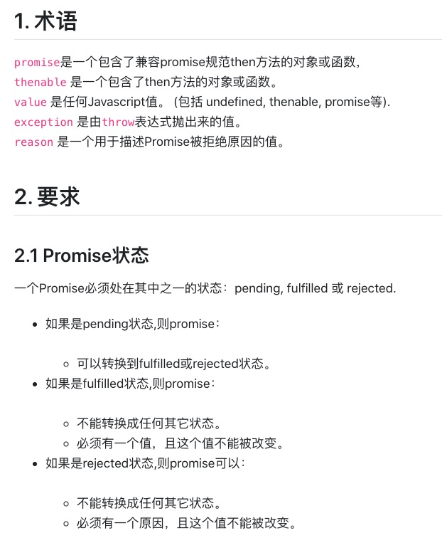
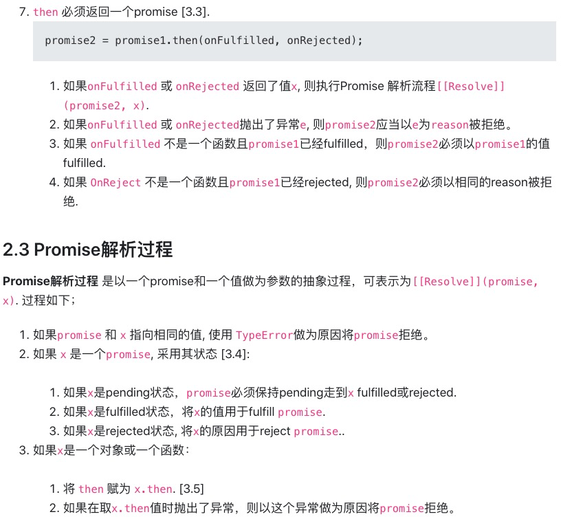
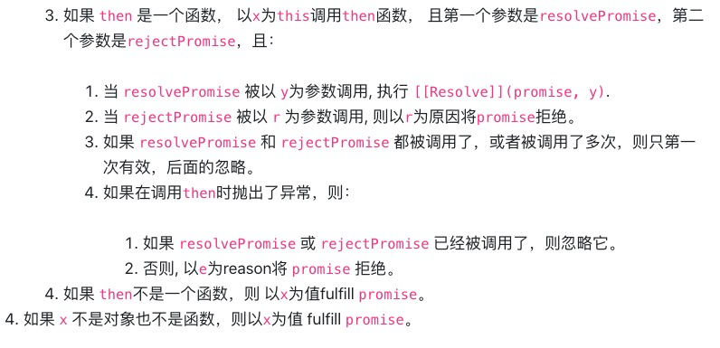

#### 闭包
红宝书上对于闭包的定义：闭包是指有权访问另外一个函数作用域中的变量的函数
在全局作用域里，A函数返回(导出)B函数，B函数有权读写A函数里的变量，这种形式称之为闭包

最简单直白的形式:

```javascript
function aFn(){
    let n = 10;
    return function BFn(){
        console.log(`I can read and write variable n , n = ${n++}`);
    }
}
let bFn = aFn();
bFn();
bFn();

```

##### 闭包存在的形式

讨论闭包产生的条件:

1、作用域。
   根据词法作用域的的理论，函数的作用域是定义时就决定了。
   当一个函数不是定义在全局作用里（全局里的块级作用域除外），就有可能产生闭包，因为产生作用域嵌套，有嵌套就可以访问本层作用域的变量。

2、函数执行时，必须跳出定义时所在的作用域，一般是在全局作用域里执行。
   如何跳出定义时的作用域？
   1. 函数返回（最常见）
   2. 函数传递使用（如事件注册、回调函数）
   3. 关联对象引用

根据以上2个产生条件说说闭包存在的形式:

1. 函数返回，参见以上。
2. 函数传递使用（如事件注册、回调函数）
看例🌰
```javascript

function aFn(){
    let n = 10;
    let show = document.getElementById('myshow');
    let btn01 = document.getElementById('btn01');
    let handClick01 = ()=>{
        console.log(`when I am clicked, n = ${n++}`);
        show.innerText = n;
    };
    btn01.addEventListener('click',handClick01,false);

    /*
    let btn02 = document.getElementById('btn02');
    let handClick02 = ()=>{
        console.log(`when I am clicked, n = ${n++}`);
        show.innerText = n;
    };
    btn02.addEventListener('click',handClick02,false);
    */
}

aFn();

//----------------对象引用--------------------
```
3. 对象引用,导出函数
``` javascript
let obj = {};
function aFn(){
    let n = 10;
    obj.bFn = ()=>{
        console.log(`n = ${n++}`);
    }
}
//依赖a的执行
aFn();
//这明显就不是纯函数
obj.bFn();
obj.bFn();
obj.bFn();
```


4. 自执行函数，这里算闭包么

```javascript

// -------闭包-------
// 非

for(var i=0,len=5;i<len;i++){
    (function(i){
        setTimeout(()=>{
            console.log(i);
        },1000*i)
    }(i))
}

```

自执行函数本质上不算闭包，只是建立一个函数，函数确定了作用域，驻守了一块作用域罢了。每生产一个函数就产生了一个函数执行行上下文，保护了参数。

以上代码可该为
```javascript
for(var i=0,len=5;i<len;i++){
    var fn = (n)=>{
        setTimeout(()=>{
            console.log(n);
        },1000*n)
    }
    fn(i); 
}
```

除了以上，就没其他形式的闭包了么,一定要2个函数？

##### ES6块级作用域，产生的函数（原创，待确认）
```javascript
let aFn = null;
{
    let n = 10;
    aFn = ()=>{
        console.log(`n = ${n++}`);
    }
}

aFn();
aFn();
aFn();


//------循环闭包-------
let obj = {};
for(let i=0,len=5;i<len;i++){
    obj[`fun${i}`] = function(){
        console.log('i have magic ',i++);
    }
}
console.log('one--obj',Object.keys(obj));
obj['fun0']();
obj['fun0']();
obj['fun0']();


obj['fun1']();
obj['fun1']();
obj['fun1']();

//ES6 的循环里已经有作用域了，一般不要定义函数！！！

```
问题：ES5可以产生以上效果(5个闭包)么，为什么？

##### 闭包的应用

1. 封装，将使用看不到的东西保存闭包里，只提供有用的方法
   比如，对防抖/节流函数的封装，后面详述，此处略过
   js高级一点封装，基本都要用到闭包.
   实现类的私有对象。

2. 包装  如React高级组件\bind函数的实现
   https://www.jianshu.com/p/0aae7d4d9bc1

3. 保护变量  
   缓存数据(页面点击已经)、柯里化(后面详述)。

类的私有属性闭包实现 

```javascript
let Person  = (()=>{
    let age = 19;
    class PersonInner{
        constructor(){
            this.name = name;
        }
        getAge(){
            return age;
        }
        updateAge(n){
            return age += n;
        }
    }
    return PersonInner;
})();

//-----另一种实现方式--------我是分割---------------消耗内存

function Person(name){
    let age = 19;
    this.name = name;

    this.getAge = function(){
        return age;
    }

    this.updateAget = function(num){
        return age += num;
    }
}
```


#### 事件循环机制
关键词:macro-task(宏任务):script 、setTimeout、setInterval 、setImmediate 、I/O 、UI rendering
micro-task(微任务) MutationObserver、Promise.then()或reject()
Mutation Observer API 用来监视 DOM 变动。比如节点的增减、属性的变动、文本内容的变动。
先从一道题目进入
```javascript
console.log(0);

setTimeout(()=>{
    console.log(1);
},0);

console.log(2);

new Promise((resolve,reject)=>{
    console.log(3);
    setTimeout(()=>{
        console.log(4);
    },0);
    resolve();
}).then(()=>{
    console.log(5);
    setTimeout(()=>{
        console.log(6);
    },0);
}).then(()=>{
    console.log(7);
});
console.log(8);
```

分析:
主线称同步任务队列,从上到下:
```javascript
console.log(0);
console.log(2);
console.log(3);
console.log(8);
//------异步队列---微任务---
console.log(5);
console.log(7);
//------异步队列---宏任务---
console.log(1);
console.log(4);
console.log(6);
```

比较
```javascript

setTimeout(()=>{
    console.log(0);
})

new Promise((resolve,reject)=>{
    console.log(4);
    reject(5);
}).catch((e)=>{
    console.log(`e=${e}`);
})

new Promise((resolve,reject)=>{
    console.log(1);
    resolve();
}).then(()=>{
    console.log(2);
})

console.log(3);

```

vue next-tick更新视图异步原理之微任务的应用：
https://github.com/vuejs/vue/blob/dev/src/core/util/next-tick.js

React setState 更新是通过 batchedUpdates 标识进行，默认是合并更新，进入异步循环里，batchedUpdates会被置为false,可以同步更新了。
https://zhuanlan.zhihu.com/p/78516581

js代码执行循序优先按，主线程同步队列、异步线程微任务、异步线程宏任务的顺序，执行。
同步队列先执行完，不管任务有多长，完毕；将微任务队列加入同步任务队列，执行完毕；将异步任务队列加入同步任务队列,执行之.................

1、如果在执行微任务过程中有新的微任务如何排队
新的微任务在同步任务队列执行完毕，继续加入同步任务队列，不会执行异步任务队列的
例子
```javascript

setTimeout(()=>{
    console.log('macro-task---000001');
});
new Promise((resolve,reject)=>{
    resolve()
}).then(()=>{
    console.log('micro-task--001');
    return Promise.reject();
}).catch(e=>{
    console.log('micro-task--002');
});

```

2、如果如果宏任务执行过程中产生新的微任务如何排队
```javascript
setTimeout(()=>{
    console.log('macro-task-001');
    Promise.resolve().then(()=>{
        console.log(`macro-task-001==>new micro-task-001`);
        setTimeout(()=>{
            console.log(`macro-task-001==>new micro-task-001==>macro-task-001`);
        },0)
    });
});

setTimeout(()=>{
    console.log('macro-task-002');
});

setTimeout(()=>{
    console.log('macro-task-003');
});
```


#### 异步  Promise\yield\Generator\async\await

先看先如果不用promise 或 async\await,我们所遇到的问题

先异步取列表信息，再异步取id信息,再取我们要的detail信息. 然后展开业务代码,代码模拟嵌套如下:
```javascript 

setTimeout(()=>{
    let list = [{name:'will',age:18}];
    setTimeout(()=>{
        let id = '12123132';
        setTimeout(()=>{
            let details = {};
            //here we can do out biz task .......
        },1000)
    },1000)
},1000);

```
此所谓地狱回调(callback hell)问题.

Promsie的解决方案:
```javascript

new Promise((resolve,reject)=>{
    //task A
    setTimeout(()=>{
        let list = [{name:'will',age:18}];
        resolve(list);
    },1000);
}).then(list=>{
    return new Promise((resolve,reject)=>{
        //task B
        console.log(`I get list data= ${JSON.stringify(list)}`);
        setTimeout(()=>{
            let id = '12123132';
            resolve(id);
        },1000);
    });
}).then(id=>{
    //task C
    console.log(`I get list data ${id}`);
    setTimeout(()=>{
        let details = {};
        //here we can do out biz task .......
        //.......
    },1000);
});

```
将一个异步的函数代码块封装成一个Promise对象 
```javascript
new Promise((resolve,reject)=>{
    // 执行异步代码块
    // 成功完成后用执行resolve()
    // 失败就执行reject(),程序内部会抛错，需要catch
}).then(data=>{

},e=>{
    console.log(`failed`);
}).catch(e=>{
    console.log(`i ma catch ${e}`);
})
```

Prmise的基本规则：

1、promise构造函数里执行异步或同步代码,通过resolve,或reject扭转promise的状态，状态扭转之后不可更改。

2、resolve执行时需传一个值value，该值可以在then的第一个回调函数里接受，并执行onFulFilled

3、reject执行时需传一个值reason,该reason可以在then的第二个回调函数里接受并执行onFailed，如何onFailed未定则忽略，直到找到catch方法，捕获该错误。不然报错.

4、catch捕获错误或,reject抛出的错误 

看看标准里怎么规定的

##### promsie A/+ 标准

https://promisesaplus.com/
https://segmentfault.com/a/1190000002452115







下面，简单实现下Promise的基本款

```javascript
function MyPromise(executor){
    this.statusMap = {
        pending:'PENDING',
        fufilled:'FULFILLED',
        rejected:'REJECTED'
    }

    this.value;
    this.reason;
    this.status = this.statusMap.pending;
    this.onFulfilled = null;
    this.onRejected  = null;
    this.catchFn = null;

    var self = this;
    try{
        executor(this.resolve.bind(this),this.reject.bind(this));
    }catch(e){
        //this.catch(e);
        this.reject(e);
    }
    
    //后面有挂载then自动执行
}

MyPromise.prototype ={
    constructor:MyPromise,
    resolve(value){
        if(this.status === this.statusMap.pending){
            this.value = value;
            setTimeout(()=>{
                var result;
                if(typeof this.onFulfilled === 'function'){
                    try{
                        result = this.onFulfilled(this.value);
                        this.nextPromise.resolve(result);
                    }catch(e){
                        this.nextPromise.reject(e);
                    }
                }
            });
        }
    },
    reject(reason){
        if(this.status === this.statusMap.pending){
            this.reason = reason;
            setTimeout(()=>{
                try{
                    if(typeof this.onRejected === 'function'){
                        var failResult = this.onRejected(this.reason);
                        this.nextPromise.resolve(failResult);
                    }else{
                        this.exeCatch(reason);
                    }
                }catch(e){
                    this.exeCatch(e);
                }
            });
        }
    },
    then(onFulfilled,onRejected){
        this.onFulfilled = onFulfilled;
        this.onRejected = onRejected;
        this.nextPromise = new MyPromise((resolve,reject)=>{

        });
        return this.nextPromise;
    },
    exeCatch(e){
        var current = this;
        while(current){
            if(typeof current.catchFn === 'function'){
                current.catchFn(e);
                current = null;
            }else{
                current = current.nextPromise?current.nextPromise:null;
            }
        }
    },
    catch(catchFn){
        this.catchFn = catchFn;
    }
}
// ---------  以下是测试 --------------------
new MyPromise((resolve,reject)=>{
    reject(1)
}).then(data01=>{

},reason01=>{
    console.log(`reason01 = ` + reason01);
    return 22
}).then(data03=>{
    console.log(`data03 = ${data03}`);
    afa;
}).catch(e=>{
    console.log(e);
});

```

promise是解决回调地狱的核心，但是没有彻底解决异步问题，把异步当同步使用，于是async,await出现了。
看例子:
```javascript
function doSomething(){
    console.log('do some thing here~~');
}


setTimeout(()=>{
    let data01 = {data:'i am data011111'};
    setTimeout(()=>{
        let data02 = {data:'i am data02222222'};
        doSomething();
    },2000);
},1000);

//-----------以下用async await 实现-----------------

function getData01(){
    return new Promise((resolve,reject)=>{
        setTimeout(()=>{
            resolve({data:'i am data011111'})
        },1000);
    });
}

function getData02(data01){
    return new Promise((resolve,reject)=>{
        setTimeout(()=>{
            resolve({data:'i am data02222222'})
        },1000);
    });
}

async function doBiz(){
   let data01 = await getData01();
   let data02 = await getData02(data01);
   doSomething();
}

```

await关键字后面必须是个Promise,如果不是会被自动封装成Promise.resolve的结果,await所在的函数里外必须加async关键字，所以async/await是成成出现的。
特点：
1. await在全局执行栈里不能使用,必须是函数里，async/await是成成出现的。
2. 有了async/await就可以抛弃promise了么？谁比谁有优势，谁会取代谁？
   并不是，await后面必须跟Promise对象，如果不是，会自用Promise.resolve()包装（或一个微任务）。async await依赖于Promise
```javascript
    function getData01(){
        return {name:'will'}
    }

    async function doBiz(){
        let data01 = await getData01();
        console.log(JSON.stringify(data01));    
    }

    doBiz();

    new Promise((resolve,reject)=>{
        console.log('before 222222222');
        resolve(222)
    }).then(data=>{
        console.log(data);
    })


    //---------------一道题-----微任务--------------------------------------------
    async function async1() {
        console.log("async1 start");
        await async2();
        console.log("async1 end");
    }

    async function async2() {
        console.log("async2");
    }

    console.log("script start");

    setTimeout(function() {
        console.log("setTimeout");
    }, 0);

    async1();

    new Promise(function(resolve) {
        console.log("promise1");
        resolve();
    }).then(function() {
        console.log("promise2");
    });

    console.log("script end");

```
3. await 后面的是同步执行，后面的微任务异步

缺点：
1. async/awiat 地狱连环套

```javascript
    function getData01(){
        new Promise((resolve,reject)=>{
            setTimeout(()=>{
                resolve({name:'will'});
            },1000);
        }).catch(e=>{
            [err]
        })
    }

    async function doBiz(){
        let data01 = await getData01();
        return data01;
    }

    let mydata = doBiz();
    console.log(mydata);

```

2. 如果不捕获错误则代码阻塞，异常捕获 try catch 或await-to-js 解决报错
https://blog.csdn.net/xjl271314/article/details/79566447
```javascript
//体会await-to-js 如何优雅的处理错误的
export default function to(promise) {
   return promise.then(data => {
      return [null, data];
   })
   .catch(err => [err]);
}
```

使用场景:
异步操作，后续流程依赖不强，可以用。
复制流程的中间环节，慎用async await,不然全世界都变成了异步函数了。

##### async await 怎么实现的，如何手动实现一个


可以暂停代码，这个有点玄.....
##### generator yield 
```javascript
const getData = () => new Promise(resolve => setTimeout(() => resolve("data"), 1000));

function* helloWorldGenerator() {
    yield getData();
    yield 'two';
    return 'three';
}

let fn = helloWorldGenerator();
console.log(fn.next());
console.log(fn.next());
console.log(fn.next());
console.log(fn.next());
console.log(fn.next());


//-------------Promsie generator- return--------------------

const getData = (data)=>{
    return new Promise(resolve => {
        console.log(data);
        setTimeout(() => {
            resolve("data")
        }, 1000);
    });
}

function* generatorFn() {
    console.log('00000');
    let data01 = yield getData('one yield~~~');
    console.log(`one next execute .....data01 = ${data01}`);

    let data02 = yield getData(`two yield~~~`);
    console.log(`two next execute .....data02 = ${data02}`);

    return 'i am last one';
}

let fn = generatorFn();


//------------
function* helloWorldGenerator() {
    yield 'one';
    yield 'two';
    yield 'three';
}

```

代码似乎可以暂停了，如何封装成async\await呢
```javascript
//---------------场景-------------
const getData = () => new Promise(resolve => setTimeout(() => resolve("data"), 1000));

async function test() {
    const data = await getData()
    console.log('data: ', data);
    const data2 = await getData()
    console.log('data2: ', data2);
    return 'success'
}

let gen = test();
let data = gen.next();
console.log(data);
let data2 = gen.next();
console.log(`data02=${data02}`);

lastData = gen.next();
console.log(`lastData=${lastData}`);


// 这样的一个函数 应该再1秒后打印data 再过一秒打印data2 最后打印success
test().then(res => console.log(res))

//-------------------------华丽的分割线------------------------------


const getData = () => new Promise(resolve => setTimeout(() => resolve("data"), 1000));

function* testG(){
    const data = yield getData();
    console.log(`data:${data}`);
    const data2 = yield getData();
    console.log(`data2:${data2}`);
    return 'success';
}

var gen = testG();
var dataPromise = gen.next();

dataPromise.then(value1=>{
    var data2Promise = gen.next(value1);
    data2Promise.value.then(value2=>{
        gen.next(value2);
    })
});


//------------------generator封装----------------------
```

#### IIFE(立即执行函数)、高阶函数、惰性函数、函数柯里化

##### IIFE  （Imdiately Invoked Function Expression 立即执行的函数表达式）

```javascript
;(function(){

})();

console.log(n);
```
形如以上，的形式我们称之为IIFE.
某些库里首个字符可以能是(;/+/-!), 因为js允许不加;结束,为了避免代码与上一行未加;的语句隔离开，加符号(;/+/-!)隔离.


作用:
1、创建了一个内部作用域，表达式内只执行一次，(通过参数传递变量)减少变量查找
这里有闭包么？
```javascript
//1、es5一个经典的场景,如何每隔一秒输出一个i,i取值0，1，2，3，4，5
//2、更短代码实现
for(var i=0,len=5;i<len;i++){
    setTimeout(function(){
        console.log(i);
    },1000);
}


//----------------- [ 方法一] ----------------------------------

for(var i=0,len=5;i<len;i++){
    //内存释放了
    (function(i){
        setTimeout(function(){
            console.log(i);
        },1000*i);
    })(i);
}

//----------------- [ 方法二 ] ---------------------------------

```
2、有全局长拼写参数时，利于压缩
```javascript
function(w, d, $) {  
    // You can now reference the window, document, and jQuery objects in a local scope  
}(window, document, window.jQuery); 
```

3、避免全局命名冲突


4、单纯的方便逻辑处理

```javascript
let column = [
    {
        name:'one'
    },(()=>{
        let name = Math.random()>0.5?'jack':'pony';
        console.log( `name = ${name} ` );
        return {
            name
        }
    })()
];
console.log(column);
```


```javascript 
var fn = null;

;(function(){
    var  n= 1;
    fn = function(){
        console.log(n+m);
        n++;
        m++;
    }
    var m = 5;
})();
```

##### 高阶函数 (Higher-order function)
基本定义:能够接收函数作为参数或将函数作为输出返回，这里的函数称之为高阶函数
常见的:map/reduce/filter/sort
```javascript
let arr = [{age:19},{age:89},{age:45},{age:13}];
//map输入一个函数，更具函数的返回确定一个新的数组
let arr02 = arr.map(item=>{
    return item.age>45?item.age:45;
});
console.log(arr02);

//-----reduce 遍历少一次，第一个参数是上次函数返回的结果，第一次默认用第一个元素

let arr = [1, 3, 5, 7, 9];
let lastResult = arr.reduce(function (x, y, i) {
    console.log(`x = ${x}--y=${y}--i=${i}`);
    return (x + y)*2;
});
console.log(`lastResult = ${lastResult}`);

//let total 
let preResult = arr[0];
for(let i=1,len=arr.length; i<len; i++){
    preResult = (function(x,y,i){
        console.log(`x = ${x}--y=${y}--i=${i}`);
        return (x + y)*2;
    })(preResult,arr[i],i);
}
console.log(`preResult = ${preResult}`);


//---------  reduce for mySelf  --------------------------

Array.prototype.myReduce = function(fn){
    let arr = this;
    let preResult = arr.length>0?arr[0]:0;
    for(let i=1,len=arr.length; i<len; i++){
        preResult = fn(preResult,arr[i],i);
    }
    return preResult;
}

//-----------------------------------------------------

//reduce
let total = arr.reduce((one,two)=>{
    return {age:(one.age + two.age)}
});
console.log(`total = ${total.age}`);


//filter输入一个函数，根据函数的条件，提出某些元素
let arr = [{age:19},{age:89},{age:45},{age:13}];
arr.filter(item=>{
    return item.age>=45
});

//sort ，根据函数的条件，排序
let arr = [{age:19},{age:89},{age:45},{age:13}];
arr.sort((one,two)=>{
    return one.age-two.age;
});
```

##### 惰性函数
惰性函数的本质就是函数重写。
当函数内部执行的分支判断或逻辑总是返回相同的结果，执行一次即可，然后重写函数，跳过之前的计算。直接进入当前的分支或得到结果。

如浏览器检测的判断，每次结果肯定相同，则
```javascript
function whichOne(){
    var userAgent = navigator.userAgent; //以下演示代码，判断结果不做保证

    //判断是否Opera浏览器
    if (userAgent.indexOf("Opera")) {
        return "Opera"
    }; 
    //判断是否Firefox浏览器
    if (userAgent.indexOf("Firefox") > -1) {
        return "FF";
    } 
    //判断是否chorme浏览器
    if (userAgent.indexOf("Chrome") > -1){
		return "Chrome";
    }
    //判断是否Safari浏览器
    if (userAgent.indexOf("Safari") > -1) {
        return "Safari";
    }
}


//----------重写-----

function whichOne(){
    var userAgent = navigator.userAgent; //以下演示代码，判断结果不做保证
    var reWrite = (result)=>{
        whichOne = function(){
            return result;
        }
        return result;
    }
    console.log(11111);
    //判断是否Opera浏览器
    if (userAgent.indexOf("Opera")) {
        return reWrite("Opera");
    }; 
    //判断是否Firefox浏览器
    if (userAgent.indexOf("Firefox") > -1) {
        return reWrite("FF");
    } 
    //判断是否chorme浏览器
    if (userAgent.indexOf("Chrome") > -1){
		return reWrite("Chrome");
    }
    //判断是否Safari浏览器
    if (userAgent.indexOf("Safari") > -1) {
        return reWrite("Safari");
    }
}

//------------------事件注册-------------------------------
function addEvent (type, element, fun) {
    if (element.addEventListener) {
        element.addEventListener(type, fun, false);
    }else if(element.attachEvent){
        element.attachEvent('on' + type, fun);
    }else{
        element['on' + type] = fun;
    }
}
//-----------重写------------------
function addEvent (type, element, fun) {
    if (element.addEventListener) {
        addEvent = function (type, element, fun) {
            element.addEventListener(type, fun, false);
        }
    }else if(element.attachEvent){
        addEvent = function (type, element, fun) {
            element.attachEvent('on' + type, fun);
        }
    }else{
        addEvent = function (type, element, fun) {
            element['on' + type] = fun;
        }
    }
    addEvent(type, element, fun);
}

//------------------实现单例子-----------------------
function Person() {

    // 缓存的实例
    var current = this;

    // 其它内容
    this.name = 'will';
    this.age = "12";

    // 重写构造函数
    Person = function () {
        return current;
    };
}

let one = new Person(); //
let two = new Person();

```

##### 函数柯里化
一个函数接受多个参数，变换成接受单一参数返回新的函数接受单一参数，如此重复直到参数和函数匹配完毕，返回结果。这样处理的方式称之为函数的柯里化。


最简单形式的理解：
```javascript
// 普通的add函数
function add(x, y) {
    return x + y
}

// Currying后
function curryingAdd(x) {
    return function (y) {
        return x + y
    }
}

add(1, 2)           // 3
curryingAdd(1)(2)   // 3


```
作用
1. 通过闭包，参数复用(也是闭包的用处)

```javascript
function check(reg,txt){
    return reg.test(txt);
}

check(/\d+/g,'test');
check(/[a-a]+/g,'test');


function curryingCheck(reg) {
    return function(txt) {
        return reg.test(txt)
    }
}

var hasNumber = curryingCheck(/\d+/g)
var hasLetter = curryingCheck(/[a-z]+/g)

hasNumber('test1')      // true
hasNumber('testtest')   // false
hasLetter('21212')    
hasLetter('23ae312') 
```

2. 延迟执行


```javascript

function curry(fn,len){
    let args = [];
    let innerFun = ()=>{
        let curArgs = Array.from(arguments);
        args = args.concat(curArgs);
        if(args.length>=len){
            return fn.apply(null,args);
        }else{
            return innerFun;
        }
    }
    return innerFun;
}

```

看一道题,实现以下功能
```javascript
// 实现一个add方法，使计算结果能够满足如下预期，按此模式可以无限扩展：
add(1)(2)(3) = 6;
add(1, 2, 3)(4) = 10;
add(1)(2)(3)(4)(5) = 15;
//...

```
//-----------------------------
//分析;
1.函数执行次数不固定
2.算法将各参数相加返回结果
3.难点,返回执行函数个数不固定，为什么可以得到值，不应该是函数本事么？
4.重新写toString方法，会怎样?

```javascript

function myFn(){

}
myFn.toString = function(val){
    return val?val:0;
}

console.log(myFn);
```
写
```javascript
function add(first){
    let total = first;
    let innerFn  = function(){
        //转数组
        //[].slice.apply(arguments);
        let args = Array.from(arguments);
        total += args.reduce((one,two)=>{
            return one + two;
        });
        return innerFn;
    }
    innerFn.toString = ()=>{
        return total;
    }
    return innerFn;
}

console.log(add(1)(2)(3,4,5)(4)(5));

```


12、其他
    节流/防抖 throttle doubance

### 防抖 debouce

【自定义】：事件触发时延时执行，如果持续触发则清空之前的定时器，重新建立定时器。
使用场景，滚动条触发事件，窗口大小改变事件，持续触发事件
（提交数据点击按钮可用按钮封锁实现）
防抖自我实现代码，
input输入实时搜索,resize,scroll,下拉加载，字面上理解节省流量。
最后一次一定执行！！！
在一段时间内只执行一次，这里的【一段时间】不是一个定值，随之执行频率不断增加。
##### 业务场景代码，不封装
``` javascript
biz();
function biz(){

    //原始函数,没有防抖，消耗性能
    let scrollHandler01 = (e)=>{
        console.log(`e=${e}--this=${this}`);
    }

    //业务场景下的处理，代码处理
    let scrollTimer = null;
    let wait = 100;
    let scrollHandler02 = (e)=>{
        if(scrollTimer){
            //清除定时器，建立新的定时器
            clearTimeout(scrollTimer);
        }
        //建立新的定时器
        scrollTimer = setTimeout(()=>{
            scrollHandler01(e);
            scrollTimer = null;
        },wait);
    }

    window.addEventListener('scroll',scrollHandler02);

    
    //抽取封装功能,必须用定时器写防抖，不能用时间间隔 
    function myDebounce(fun,wait,context=this){
        let deBouceTimer = null;
        return ()=>{
            if(deBouceTimer){
                clearTimeout(deBouceTimer); 
            }
            deBouceTimer = setTimeout(()=>{
                fun.apply(context,arguments);
                deBouceTimer = null;
            },wait);
        }
    }

    //原始函数,没有防抖，消耗性能
    let scrollHandler01 = (e)=>{
        console.log(`e=${e}--this=${this}`);
    }

    window.addEventListener('scroll',myDebounce(scrollHandler01,100));

}
```


### 节流函数

input输入时时搜索,一定时间内执行一次。
节流函数，节省流量


```javascript 
//业务场景，代码不封装,直接在业务里
var someBizFun = ()=>{
    console.log('give a request!');
}

let bizExeTimes = 0;
let startTime = Date.now();
let step = 100;
let isFirst = true;
let currentTime = null;

let bizTimer = setInterval(()=>{
    currentTime = Date.now();
    bizExeTimes++;
    if(bizExeTimes>=1000){
        clearInterval(bizTimer);
    }

    if(!isFirst){
        isFirst = false;
        someBizFun();
    }else if(currentTime-startTime>=step && !isFirst){
        someBizFun();
        startTime = currentTime;
    }
    /*
    setTimeout(()=>{
        exeFun();
    },30)
    */
},20);

```


``` javascript
//抽取通用的绑定
function myDebounce01(func,ms= 500,immediate=true,context=this){
    let lastTime = 0;
    return ()=>{
        let afterMsExe = ()=>{
            let currentTime = new Date().getTime();
            if(currentTime - lastTime>=ms){
                func.apply(context,arguments);
                lastTime =  currentTime;
            }
        };
        if(immediate){
            //立即执行函数,用闭包、时间差对比
            if(lastTime === 0){
                func.apply(context,arguments);
                lastTime = new Date().getTime();
            }else{
                afterMsExe();
            }
        }else{
            afterMsExe();
        }
    }
}


//用new Date和 setTimeout实现
function myDebounce02(func,ms=500,immediate=true,context=this){
    let lastTime = 0;
    let timer = null;
    return ()=>{
        if(immediate){
            //立即执行函数,用闭包、时间差对比
            if(lastTime === 0){
                func.apply(context,arguments);
                lastTime = new Date().getTime();
            }else{
                let currentTime = new Date().getTime();
                if(currentTime - lastTime>=ms){
                    func.apply(context,arguments);
                    lastTime =  currentTime;
                }
            }
        }else{
            //延时执行....
            if(!timer){
                timer = setTimeout(()=>{
                    func.apply(context,arguments);
                    timer = null;
                },ms);
            }
        }
    }
}
```


### 测试 节流函数，单位时间内执行一次,触发时间越长执行次数越多
``` javascript
//validate
function test(){
    clickFun.times = 0;
    function clickFun(){
        clickFun.times++;
        console.log('I am click, times=' + clickFun.times);
    }
    //包裹成新的防多次执行函数,
    let clickFunNew = myDebounce02(clickFun,1000);
    let allTimes = 0;
    let bizTimer = setInterval(()=>{
        clickFunNew();
        allTimes ++;
        if(allTimes>=100){
            clearInterval(bizTimer);
        }
    },50);
}
test();
```


13、javascript 内存回收机制


