### 前端知识体系之__深入理解javascript

#### 第一章 值类型、引用类型、深复制、浅复制以及类型的判断的方法

首先类型是针对变量的

数据类型
值类型:string、number、boolean、symbol、null、undefined
引用类型:object、array

js其他类型
引用类型: RegRxp、Date、Function、Promise、Error、Arguments、Set、WeakSet、Map、WeakMap


```javascript

let obj01 = {
    name:'will',age:18
};
let obj02 = obj01;
obj02.age = 20;
console.log(obj1,obj2);
//------------------------

let obj01 = {
    name:'will',age:18
};
let obj02 = {
    name:'lilei',age:19,height:180
};
obj01.height = obj01 = obj02.height;

console.log(obj01.height,obj02);

```


##### json可传递的数据类型
```javascript
let arr01 = ['',1,true,null,{name:'I am a object'},[1,2,3,4]]; //可传递数据类型
let arr02 = [undefined,Symbol(0),/\s/g,new Date(),()=>{},Promise.resolve(),new Person(),new Error(''),new Set(),new Map(),new WeakSet(),new WeakMap()]; //不可传递类型
let jsonData = {
    arr01, arr02
}
function Person(){
    this.name = 'will';
    this.age = 25;
}
console.log(JSON.stringify(jsonData));
```

##### js类型万能判断方法 Object.prototype.toString
```javascript
//js类型万能判断方法
let arr01 = ['',1,true,null,{name:'I am a object'},[1,2,3,4]]; //可传递数据类型
let arr02 = [undefined,Symbol(0),/\s/g,new Date(),()=>{},Promise.resolve(),new Person(),new Error(''),new Set(),new Map(),new WeakSet(),new WeakMap()]; //非数据类型、js类型与代码绑定

function Person(){
    this.name = 'will';
    this.age = 25;
}

//Object.prototype.toString 判断类型
function whatType(params){
    let types = [];
    params.forEach(item=>{
        types.push(Object.prototype.toString.call(item));
        //types.push({}.toString.call(item));
    });
    console.log(JSON.stringify(types));
}

whatType(arr01);
whatType(arr02);

//方法可替代，短写方式（原创）
({}).toString  === Object.prototype.toString
[].toString === Object.prototype.toString
```

##### typeof 判断类型 胜算几何？
``` javascript

let arr01 = ['',1,true,undefined,null,{name:'I am a object'},[1,2,3,4]];
let arr02 = [undefined,Symbol(0),/\s/g,new Date(),()=>{},Promise.resolve(),new Person(),new Error(''),new Set(),new Map(),new WeakSet(),new WeakMap()]; //非数据类型、js类型与代码绑定

function Person(){
    this.name = 'will';
    this.age = 25;
}

function whatTypeOf(params){
    let types = [];
    params.forEach(item=>{
        types.push(typeof item);
    });
    console.log(JSON.stringify(types));
}

whatTypeOf(arr01);
whatTypeOf(arr02);

```
值类型可以正确判断，
对象类型的判断太浅了，不够深入，不推荐使用

##### instanceof 类型判断
```javascript

//[undefined,undefined],[null,null] 取出不是构造器的类型
//Undefined 不是构造函数，Null 不能用instanceof判断
let arr01 = [['',String],[1,Number],[true,Boolean],[{name:'I am a object'},Object],[[1,2,3,4],Array]];

let arr02 = [[new String(''),String],[ new Number(1),Number],[new Boolean(true),Boolean],[{name:'I am a object'},Object],[[1,2,3,4],Array]];

let arr03 = [[Symbol(0),Symbol],[/\s/g,RegExp],[new Date(),Date],[()=>{},Function],[Promise.resolve(),Promise],[new Person(),Person]];

let arr04 = [[Symbol(0),Object],[/\s/g,Object],[new Date(),Object],[()=>{},Object],[Promise.resolve(),Object],[new Person(),Object]];

function Person(){
    this.name = 'will';
    this.age = 25;
}

function instanceOfIsRight(param){
    let resultList = [];
    param.forEach(itemArr=>{
        resultList.push({result:(itemArr[0] instanceof itemArr[1]),realType:itemArr[1].name});
    });
    console.log(JSON.stringify(resultList));
}

//测试
instanceOfIsRight(arr01);
instanceOfIsRight(arr02);
instanceOfIsRight(arr03);
instanceOfIsRight(arr04);

```
精确指定实例和构造函数，能正确得出结果。值类型必须是通过构造器函数生产，否则无法判断。
Symbol、undefind、null无法判断
Symbol is not a constructor,Symbol不是构造函数不能用instanceof来判断,
可以用instanceof判断对象类型，不推荐


##### constructor 判断数据类型

```javascript

//[undefined,undefined],[null,null] 取出不是构造器的类型
//Undefined 不是构造函数，Null 不能用instanceof判断
//Symbol不是构造函数，无法用__proto__判断
let arr01 = [['',String],[1,Number],[true,Boolean],[{name:'I am a object'},Object],[[1,2,3,4],Array]];

let arr02 = [[new String(''),String],[ new Number(1),Number],[new Boolean(true),Boolean],[{name:'I am a object'},Object],[[1,2,3,4],Array]];

let arr03 = [[Symbol(0),Symbol],[/\s/g,RegExp],[new Date(),Date],[()=>{},Function],[Promise.resolve(),Promise],[new Person(),Person]];

function Person(){
    this.name = 'will';
    this.age = 25;
}

function constructorIsRight(param){
    let resultList = [];
    param.forEach(itemArr=>{
        resultList.push({result:(itemArr[0].constructor === itemArr[1]),realType:itemArr[1].name});
    });
    console.log(JSON.stringify(resultList));
}

//测试
constructorIsRight(arr01);
constructorIsRight(arr02);
constructorIsRight(arr03);

```
constructor大部分能准确判断，undefined，null,因为没有constructor,所以无法判断。


##### 栈内存/堆内存
浅/深拷贝   
栈内存/堆内存
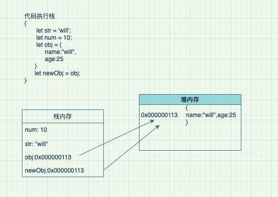
值类型变量，存放在栈内存。
引用本体存堆内存，引用地址存栈内存，代码在栈内存运行的，如果是单纯的赋值操作的化是，值类型变量得到只是引用，无法完成深复制。

值类型，值本身就是内容，内存空大小已定；放在栈内存里执行快；LIFO(先进后出)
引用类型，可以任意扩展，大小空间不确定，放堆内存；（树型结构）
如此分类原因是执行效率原因而分配的。

##### undefined、null的区别

undefined可能存在的几个地方（默认存在）：
1、变量定义，未负值，取值是返回undefined; 
2、函数没有返回取函数执行结果返回undefined;
3、取对象上不存在的属性，返回undefined;
4、函数定义了形参，但没有传递实参
5、使用void对表达式求值 
其他你想取缺不存在的值。

null存在地方(手动赋值，人为操作):
1、一个变量未初始之前的初始值，将来是要被赋值为对象（引用类型的）
2、切断一个变量和对象的引用，主动给变量赋的值；

```javascript
undefined == null  //true
undefined !== null  //true
console.log(typeof undefined,typeof null);
```


-------------###----js判断类型结论---###----------------

1、判断类型如果是值类型用或Function用 typeof,  遇到null需要特殊处理下
2、引用类型推荐使用Object.prototype.toString(或者简写 ({}.toString) ),几乎是万能了，除了自定义的类实例
3、自定义的类实例用instanceof 或者 constructor

-------------###------------------###----------------


先做到道题，然后继续

```javascript
let pony = {
    name:'pony',
    hasMoney:'2000亿'
};

let jacky = {
    name:'jacky',
    //hasMoney:'4000亿'
}

pony.hasMoney = (function(){
    pony = jacky;
    return '7000亿';
})();


//How money dose pony has?

//------原题---------
var a = {n: 1};
var b = a;
a.x = a = {n: 2};

a.x 	
b.x 	

```


##### 如何实现深拷贝
1. 哪些类型需要复制,哪些不要复制。
需要复制:数据类型的内容需要。
不需要复制:函数、Promise、RegExp、Error等代码内容或代码对象

看下lodash实现了哪些深复制，一下是一个分支,也是主要类型:
https://github.com/lodash/lodash/blob/master/.internal/baseClone.js
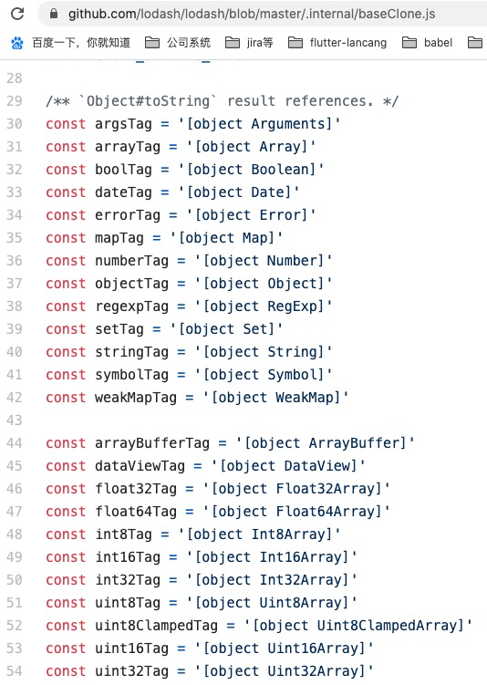

基础版 json字符串的内容


深复制方法 1
```javascript
//json
function deepCloneBase(obj){
    let newObj;
    try{
        newObj = JSON.parse(JSON.stringify(obj));
    }catch(e){
        newObj = obj;
    }
    return newObj;
}
```

深复制方法 2
手写实现版
```javascript

//https://github.com/typeis/typeis/blob/master/typeis.js
//判断类型的库,加注释36行

function typeIs(obj){
    let toString = Object.prototype.toString;
    let resultStr = toString.call(obj);
    let typeMap = {
        '[object Array]':'isArray',
        '[object Object]':'isObject',
        '[object Date]':'isDate',
        '[object String]':'isString',
        '[object Number]':'isNumber',
        '[object Boolean]':'isBoolean',
        '[object Undefined]':'isUndefined',
        '[object Null]':'isNull',
    }
    return typeMap[resultStr];
}
//每次执行覆盖
typeIs.isValueType = (value)=>{
    let valueType = false;
    let valueTypeList = ['isString','isNumber','isBoolean','isUndefined','isNull'];
    if(valueTypeList.indexOf(typeIs(value))>-1){
        valueType = true;
    }
    return valueType;
}

//深复制浅版
function deepClone(obj){
    let newObj;
    let type = typeIs(obj);
    //值类型,直接返回
    if(typeIs.isValueType(obj)){
        return obj;
    }else{
        if(type === 'isObject'){
            newObj = {};
            for(let k in obj){
                if(obj.hasOwnProperty(k)){
                    //迭代
                    newObj[k] = deepClone(obj[k]);
                }
            }
            return newObj;
        }else if(type === 'isArray'){
            newObj = [];
            obj.forEach(item=>{
                //迭代
                newObj.push(deepClone(item));
            });
            return newObj;
        }else if(type === 'isDate'){
            return new Date(obj);
        }else{
            //未知类型暂不支持
            return obj;
        }
    }
}
//测试以上代码

```
##### 解决循环引用问题
```javascript

let obj2 = {};
obj1 = {
    name:'will',
    age:18,
    child:obj2
}

obj2.height = 180;
obj2.father = obj1;

let obj3 = {
    obj1,obj2
}

console.log(JSON.stringify(obj3));

////-----------------分割线-----------------------

function deepCloneNew(obj,objContainer=new Map){
    let newObj;
    let type = typeIs(obj);
    if(objContainer.has(obj)){
        return objContainer.get(obj);
    }
    //值类型,直接返回
    if(typeIs.isValueType(obj)){
        return obj;
    }else{
        if(type === 'isObject'){
            newObj = {};
            //将新的对象存储
            objContainer.set(obj,newObj);
            for(let k in obj){
                if(obj.hasOwnProperty(k)){
                    //迭代
                    newObj[k] = deepCloneNew(obj[k],objContainer);
                }
            }
            return newObj;
        }else if(type === 'isArray'){
            newObj = [];
            //将新的对象存储
            objContainer.set(obj,newObj);
            obj.forEach(item=>{
                //迭代
                newObj.push(deepCloneNew(obj[k],objContainer));
            });
            return newObj;
        }else if(type === 'isDate'){
            return new Date(obj);
        }else{
            //未知类型暂不支持
            return obj;
        }
    }
}

```


JSON.parse(JSON.stringify())能解决开发中95%以上的深复制问题，如果解决不了，用lodash,如何还解决不了，问一问自己，我想做什么？复制代码么


##### 结论

深复制通常用的方法：

1、JSON.parse(JSON.stringify(obj));

2、loadash 提供的方法 _.cloneDeep(obj);

3、自我实现
   (通常意义考虑数据类型: String、Number、Boolean、Null、Object、Array)
   在考虑深点：循环嵌套,用缓存处理

```javascript

```


###### 课后习题
思考题如何手动实现JSON.stringify,如何提高JSON.stringify性能

```javascript
//your code is here...
```


#### 一切皆对象 

对象的定义
对象拥有一系列属性或方法的变量的集合。（内部理解）
对象的三种创建方式


```javascript
//方法 1
let obj01 = {name:'will',age:18};
obj01 = new Object({name:'will',age:18});

//方法 2
let obj02 = Object.create({name:'will',age:18});

//方法 3 
function Obj(name,age){
    this.name = name;
    this.age = age;
}
let obj03 = new Obj('will',18);

```

差异：
```javascript
let objList = [obj01,obj02,obj03];

//直接打印
console.log(obj01,obj02,obj03);

//看构造函数
objList.forEach(itemObj=>{
    console.log(itemObj.constructor);
})
//看原型
objList.forEach(itemObj=>{
    console.log(itemObj.__proto__);
})
//对象的直系属性或方法判断
objList.forEach(itemObj=>{
    console.log('name',itemObj.hasOwnProperty('name'));
    console.log('age',itemObj.hasOwnProperty('age'));
})

```
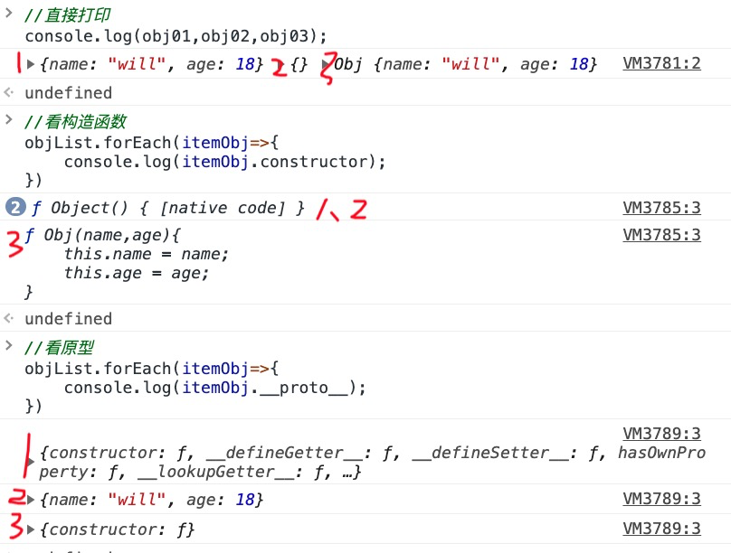

测试题
```javascript
var a: any = { n: 1};
var b = a;
a.x = a = { n: 2 };

console.log(a.x);
console.log(b.x);
```

##### js new过程到底值执行了什么

obj01、obj02、obj03 对外表现的属性或方法是一致的，但内部构成缺不一致。对于开发业务来说表现一致，当是，总有人想问这样的问题：new过程到底值执行了什么？

思考：......
1、执行构造函数，得到一个新对象
2、将构造函数的原型，挂载到新对象上
3、得到新对象

```javascript

function Person(name,age){
    this.name = name;
    this.age = age;
}

Person.prototype = {
    sayHello:function(){
        console.log(`hello,I am ${this.name}, ${this.age} !`);
    }
}

let one = new Person('will',18);
one.sayHello();

```
如何将原型挂载到一个【实例对象】上？如何......

```javascript
//不是Person, 这里是类对象，是构造函数，
Person.prototype = {
    sayHello:function(){

    }
}
```
Object.create,以传入的对象为原型，创建一个新对象，

```javascript

function Person(name,age){
    this.name = name;
    this.age = age;
}

Person.prototype = {
    sayHello:function(){
        console.log(`hello,I am ${this.name}, ${this.age} !`);
    }
}

function myNew(ClassFun,...rest){
    /*
    //构造函数参数的获取,风骚的操作 arguments 是like-array类型的对象
    let slice = Array.prototype.slice;
    let params = slice.call(arguments,1);
    */
    ClassFun.prototype.constructor = ClassFun;
    let obj = Object.create(ClassFun.prototype);
    let returnObj = ClassFun.apply(obj,rest);
    //构造函数如何返回对象类型的
    //当函数有返回值，且是值类型，无视，继续以类的形式输出；如何是Object/Array,则该回改返回值
    if(returnObj && typeof returnObj === 'object'){
        return returnObj;
    }else{
        return obj;
    }
}
//测试 ，对比one 和 two 的区别
var one = new Person('will01',18);
var two = myNew(Person,'will02',20);

console.log(one,two);
//对比2者的区别

```

##### Create.Object做了，如何实现
创建了一个空对象，将参数作为原型，将空对象为实例对象，并将原型挂载到该实例对象上。
关键点，给实例对象隐式的挂载__proto__;

!!!发现了一个有用的方法 Object.setPrototypeOf(obj,prototype);

``` javascript
let obj = {name:'will',age:18};

function myCreateObject(obj){
    let F = function () {}
    F.prototype = obj;
    return new F()
}

let one = myCreateObject(obj);
let two = Object.create(obj);

//对比差异
console.log(one,two);

//构造器名字的差异,其他都和实现
```


#### 原型与原型链
关键词：prototype/__proto__/constructor/Object.prototype.toString()/instanceof

类对象（构造函数/构造器/构造器函数）:js没有类的直接实现，通过函数来模拟的。
    1、类型一定是函数， 
    2、可以用new运算符来运行
实例对象:
    在js里一切皆对象,所以一切对象我们都可以认为是实例对象。
    
任何对象，我们都可以认为是实例对象,类对象则需要满足以上2个条件。

类对象和实例对象的身份转换：
类对象、实例对象的身份不是固定的。当类对象被当作一个函数来使用时，其实就是一个Function的实例。当一个实例对象，执行 new运算符时，此时它就是个构造函数就是类对象。具体身份看使用场景。

测试题，下面2个对象是什么对象?
```javascript
function Person01(name,age){
    this.name = name;
    this.age = age;
}

class Person02{
    constructor(){
        this.name = name;
        this.age = age;
    }
}

```
ES 6 class,是显示声明的类，不可以当作函数执行，但仍然可以被当作对象执行，仍然可以被当实例对象， constructor指向Funciton.


提问: 所有函数都可以执行new运算么？所有函数的都是可以用()来执行么？

```javascript
let one = new Symbol();
let two = new Promise(()=>{});

let three = Symbol();
let four = Promise();
```

Symbol 不能当作构造器来用，不可以是类对象. Promise不可以当作函数来执行，一般不当做实例对象来讨论。

虽然实例对象和类对象在一定条件下可以相互转换，但我们一般以这个对象优先表现出来的属性或用处来讨论他们的归属与类还是实例，进而讨论其原型特征。不做强制限制。

//讨论时，用优先归属，讨论其特征
```javascript
//Promise\Symbol

//优化是看作是类
function Person(name,age){
    this.name = name;
    this.age = age;
}

//优先看作是函数
function sayHello(){
    alert('hello,everyone! I am instance object !');
}
```

##### prototype
个人理解，非定义。
prototype(原型),首先是一个【类对象（构造函数/构造器/构造器函数）】一个属性，指向一个对象(该对象一般有个默认的属性constructor指向构造函数)。
作用：为生成的实例对象扩展方法的一种设计方案。

```javascript

function Person01(name,age){
    this.name = name;
    this.age = age;
    this.sayHello = function(){
        console.log(`hello I am ${this.name}  , ${this.age} ages old.`);
    }
}

function Person02(name,age){
    this.name = name;
    this.age = age;
}
Person02.prototype = {
    constructor:Person02,
    sayHello:function(){
        console.log(`hello I am ${this.name}  , ${this.age} ages old.`);
    }
}

let one01 = new Person01('will01',18);
let one02 = new Person01('will01',18);
let two01 = new Person02('will02',19);
let two02 = new Person02('will02',19);

console.log(one01 instanceof Person01);
console.log(one01.sayHello === one02.sayHello);

console.log(two01 instanceof Person02);
console.log(two01.sayHello === two02.sayHello);

```
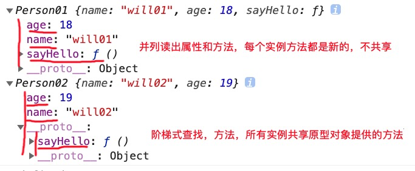

将方法写在构造函数中，每次生成出来的实例所拥有的方法都是新的，占用独立的内存，不是好的方式。而通过类对象（构造函数）通过prototype挂载，生成的实例拥有方法指向同一个内存地址，节省内存。


##### __proto__
__proto__是实例对象上一个内置属性，该属性指向类对象的原型(prototype)对象。
类的prototype属性，和该类实例的__proto__属性指向同一个对象。
按照js一节皆对象的原则，一个对象都可以看做是实例对象，都有自己的__proto__属性，都是自己的constructor属性

```javascript
function Person01(name,age){
    this.name = name;
    this.age = age;
    this.sayHello = function(){
        console.log(`hello I am ${this.name}  , ${this.age} ages old.`);
    }
}

let one = new Person01('will',18);

/*
如何构造函数没有显示指定自己的prototype，js会默认指定个一个Person01.prototype = {
    constructor:Person01
},
所以当我们显示指定一个prototype时，需要显示指定constructor属性，让实例对象不迷路，能通过constructor找到自己构造函数.
*/

function Person(name,age){
    this.name = name;
    this.age = age;
}
Person.prototype = {
    //推荐将prototype对象里的constructor属性指向构造函数
    constructor:Person,
    sayHello:function(){
        console.log(`hello I am ${this.name}  , ${this.age} ages old.`);
    }
}


let one = new Person('will',18);
Person.prototype === one.__proto__;

//推荐的写法，默认是支持的
Person.prototype.constructor === Person;
one.__proto__.constructor === Person;
one.constructor === Person;

```
实例的constructor属性，指向构造生成实例的构造函数。一切对象都有自己的constructor。
一切对象都可以认为自己是实例，都可以通过constructor属性找到构造自己的类
提供了通过实例寻找类的方法。

##### 原型链

当一个实例查询属性或方法，先从构造器里属性方法查起，找不到去自己的原型里找，在找不到去继承的类的原型里找，在找不到去继承的类的原型里找...，最后一次继承是Object的原型，如果都找不到，那么就undefined.这种查询方式叫原型链查找，实例对象的属性或方法，拥有的这种链式的结构的分布，叫做原型链。

```javascript

function Person02(name,age){
    this.name = name;
    this.age = age;
}
Person02.prototype = {
    constructor:Person02,
    sayHello:function(){
        console.log(`hello I am ${this.name}  , ${this.age} ages old.`);
    }
}

let one = new Person02('will',19);
console.log(one);

```

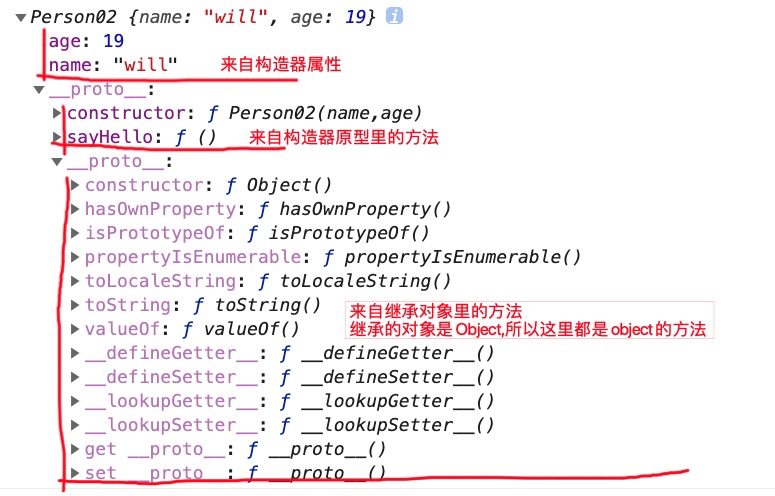

这里解释为什么在js的世界一切皆对象对象,所有原生对象最终都是继承自Object,所有通过new运算符生产的对象也都继承自Object，都是Object的实例，所以都是对象. 

``` javascript
let list = [Promise,Set,Symbol,Function,Number,Array,Boolean,new String(''),new Number(1),new Boolean(true)];
list.forEach(item=>{
    console.log(item.toString(),item instanceof Object);
})
```

##### 一切皆对象的字面量例外
通过字面量生产的之类变量，并不是Object的实例，如下:

``` javascript
let list = ['',123,true,null,undefined,NaN];
list.forEach(item=>{
    console.log(({}).toString.call(item),item instanceof Object);
})
```

##### instanceof 判断的原理（依据）
判断实例是不是某类对象的实例，去实例对象的原型链里寻找，如果原型链里的某一环原型与类对象的原型一致，就认为该实例是该类对象的实例。


所以，一个实例可以是多个类对象的实例。

##### isPrototypeOf
isPrototypeOf() 方法用来检测一个对象是否存在于另一个对象的原型链中，如果存在就返回 true，否则就返回 false。
与 instanceof 有相似的检测

解读下一下执行结果：

``` javascript
var f = function () {}
console.log(Object.prototype.isPrototypeOf(f));  
console.log(Function.prototype.isPrototypeOf(f));  
console.log(Function.prototype.isPrototypeOf(Object));  
console.log(Object.prototype.isPrototypeOf(Function));  
console.log(Object.prototype.isPrototypeOf(Object.prototype));  
console.log(Object.prototype.isPrototypeOf(Function.prototype));  
console.log(Function.prototype.isPrototypeOf(Function.prototype));  
console.log(Function.prototype.isPrototypeOf(Object.prototype));  
```


```javascript

function Person02(name,age){
    this.name = name;
    this.age = age;
}
Person02.prototype = {
    constructor:Person02,
    sayHello:function(){
        console.log(`hello I am ${this.name}  , ${this.age} ages old.`);
    }
}

let one = new Person02('will',18);
console.log(one instanceof Person02);
console.log(one instanceof Object);

```

##### typeof 的实现原理

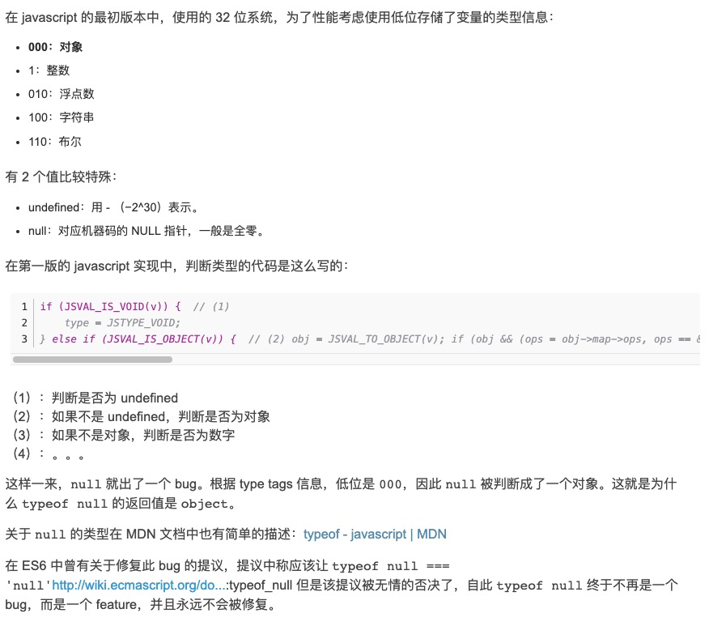
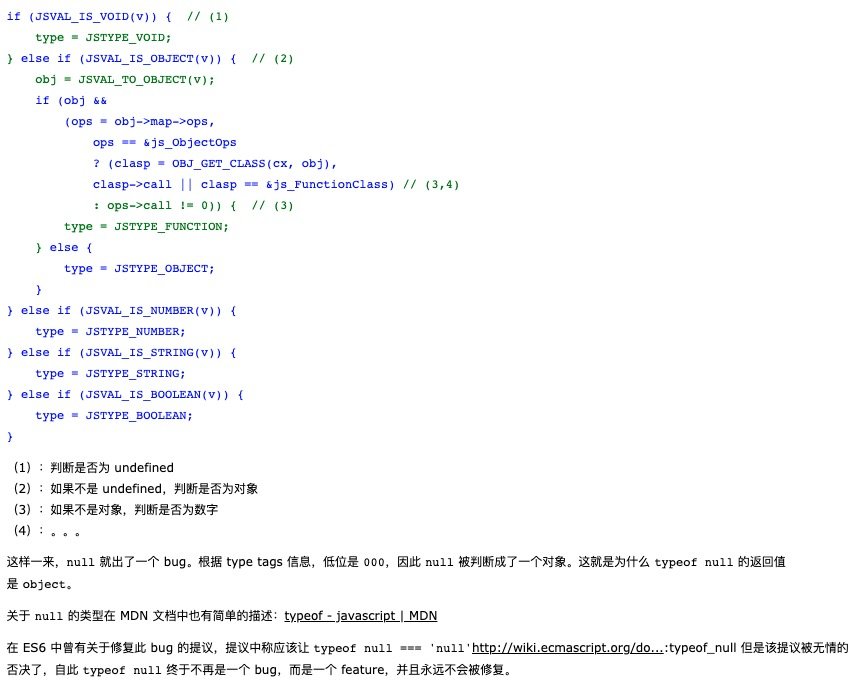

原理是这样的，不同的对象在底层都表示为二进制，在 JavaScript 中二进制前三位都为 0 的话会被判断为 object 类型，null 的二进制表示是全 0，自然前三位也是 0，所以执行 typeof 时会返回“object”。

除了null以外的值类型及函数判断都是完美的，引用类型的判断最好别用typeof

提问：能聊一聊你理解的原型和原型链么？


#### 继承的实现方式

关键词:构造函数继承/原型链继承/组合继承/原型式继承/寄生式继承/寄生组合式继承   

何为继承？
子类实例化过程中，父类、子类的构造函数都是得到顺序执行，实例化以后，子类实例得到父类实例的所有属性与方法，(相同的属性或方法，会通过子类覆盖父类处理)，并且（子类的实例 instanceof 父类/子类） 都是true。
能实现以上描述的父类、子类，我们称之为子类实现了对父类的继承。


看看ES6是如何实现继承的
```javascript
//看下ES6的实现
class Father{
    constructor(name,age){
        this.name = name;
        this.age = age;
    }
    sayHello(){
        console.log(`hello,I am ${this.name}, ${this.age} !`);
    }
}

class Child extends Father{
    constructor(name,age,gender,height){
        super(name,age);
        this.gender = gender;
        this.height = height;
    }

    goHome(){
        console.log(`I am ${this.name}, ${this.gender},${this.height}, ${this.age} years old. I am going home!`);
    }
}

let one = new Child('will',18,'male',180);

console.log(one);
```
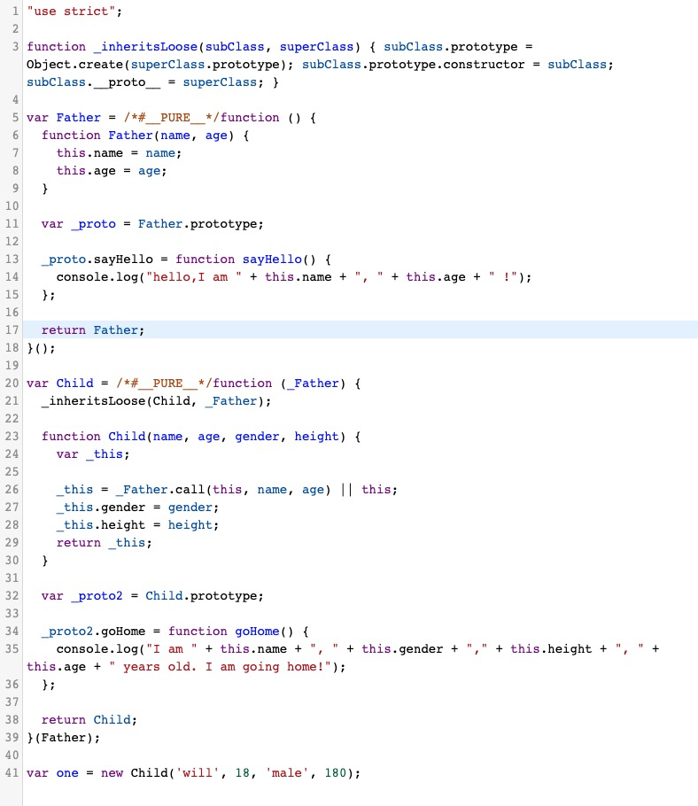
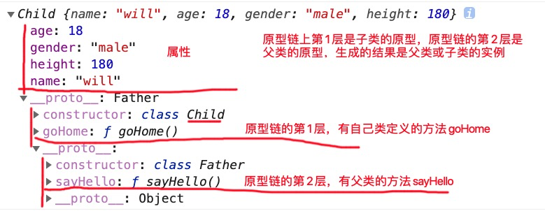

beautiful! but not perfect!


我的继承实现，__proto__不兼容如何处理
__proto__的不推荐
```javascript
function Father(name,age){
    this.name = name;
    this.age = age;
}
//如果显示定义怕prototype对象的化，请一定手动加上constructor属性
Father.prototype = {
    constructor:Father,
    sayHello:function(){
        console.log(`hello,I am ${this.name}, ${this.age} !`);
    }
}

function Child(gender,height){
    this.gender = gender;
    this.height = height;
}

Child.prototype = {
    constructor:Child,
    goHome(){
        console.log(`I am ${this.name}, ${this.gender},${this.height}, ${this.age} years old. I am going home!`);
    }
}

//继承实现【原创】 __proto__ 兼容性有待考验
Function.prototype.myExtends = function(Father,FatherParams,selfParams){
    let obj = {};
    Father.apply(obj,FatherParams);
    this.apply(obj,selfParams);
    obj.__proto__ = this.prototype;
    this.prototype.__proto__ = Father.prototype;
    return obj;
}

let one = Child.myExtends(Father,['will',19],['male',180]);

```

##### 通用的ES5寄生组合式继承
```javascript
function Father(name,age){
    this.name = name;
    this.age = age;
}
//如果显示定义怕prototype对象的化，请一定手动加上constructor属性
Father.prototype = {
    constructor:Father,
    sayHello:function(){
        console.log(`hello,I am ${this.name}, ${this.age} !`);
    }
}

function Child(gender,height,fatherParams){
    Father.apply(this,fatherParams);
    this.gender = gender;
    this.height = height;
}
// 提问，
// 需要人有说出用Object.create的原因? 这点很很很很重要！继承的关键!
Child.prototype = Object.create(Father.prototype);
Child.prototype.constructor = Child;
Child.prototype.goHome = function(){
    console.log(`I am ${this.name}, ${this.gender},${this.height}, ${this.age} years old. I am going home!`);
}


let one = new Child('male',180,['will',18]);

console.log(one);
```
以上3个继承方法，使用方法不一样但却实现了完全同样的功能。666！

##### 解读网上6继承方式

https://blog.csdn.net/kingsleytong/article/details/68943675
1、构造继承     继承补全
2、原型链继承   (实现了)   所有子类的实例的原型都共享同一个超类实例的属性和方法
3、组合继承     实际上子类上会拥有超类的两份属性，构造函数执行了2次
4、原型式继承   好没有实现继承吧
5、寄生式继承   静态的？
6、寄生组合继承


#### 函数this的指向,call,apply,bind
    
call,apply,bind

##### 为什么要用this?
this本来是以class为基石的面向对象语言设计类的时候，内部指向实例。
javascript是用函数和原型的方式模拟类,this存在函数里，根据执行环境不一样有不同的指向。

```javascript
//普通函数及回调
let name = 'will00';
let age = 0;

//var  name = 'will00';
//var  age = 0;
function sayHello(){
    console.log(`My name is ${this.name}, I am ${this.age}`);
}

let obj01 = {
    name:'will01',
    age:11,
    sayHello(){
        console.log(`My name is ${this.name}, I am ${this.age}`);
    }
}

let obj02 = {
    name:'will02',
    age:12,
    _sayHello(cb){
        if(typeof cb === 'function'){
            cb(this);
        }
    },
    sayHello(cb){
        if(typeof cb === 'function'){
            cb.call(this);
        }
    }
}

let newSayHello = obj01.sayHello;
sayHello();
newSayHello();
obj01.sayHello();


obj02.sayHello(obj01.sayHello);
obj02._sayHello(obj01.sayHello);
obj02.sayHello(sayHello);
console.log(obj02);


//类函数及回调
let obj03 = {
    name:'will03',
    age:13,
    sayHello(cb){
        if(typeof cb === 'function'){
            cb.call(this);
        }
    }
}
function Person(name,age){
    this.name = name; 
    this.age = age;   
}

Person.prototype = {
    sayHello(){
        console.log(`My name is ${this.name}, I am ${this.age}`);
    }
}

let one = new Person('onePerson',25);
one.sayHello();
one.sayHello.call(obj03);
obj03.sayHello(one.sayHello);


//闭包及回调
function fun(){
    this.name = 'will';
    this.age = 100;
    this.obj = {
        name:'will0002',
        age:12
    }
    return function(){
        console.log(`My name is ${this.name}, I am ${this.age}`);
    }
}

fun()();
fun().call(obj);

```
ES5，在全局作用域下用var声明的变量,定义在window下，用let声明的变量则不是。
由以上代码可得，函数的内部this的指向,由函数【执行时的调用方】确定的。
确定方法，（call、apply,bind除外）,【找到函数执行的小括号】，从右向左，看， 
执行小括号 <= 函数名 <= 函数的调用方 
执行小括号 <= (匿名函数)函数名 <= window/global

##### 如何改变this指向
函数的灵活性也在于此。

```javascript

function sayHello(){
    if(arguments[0]&&arguments[1]){
        this.name = arguments[0];
        this.age = arguments[1];
    }
    console.log(`My name is ${this.name}, I am ${this.age}`);
}

let obj01 = {
    name:'will01',
    age:11
}

let obj02 = {
    name:'will02',
    age:12,
    sayHello(){
        console.log(`My name is ${this.name}, I am ${this.age}`);
    }
}

let obj03 = {
    name:'will03',
    age:33
}

sayHello('namegogogo',111);
sayHello.call(obj01,'namegogogo',111);
sayHello.apply(obj01,['namegogogo',111]);
sayHello.bind(obj02)();
sayHello.bind(obj02)('namegogogo',111);


obj02.sayHello.call(obj03);
obj02.sayHello.apply(obj03);
obj02.sayHello.bind(obj03)();

```

##### bind和call/apply谁优先级更高

```javascript
function sayHello(){
    if(arguments[0]&&arguments[1]){
        this.name = arguments[0];
        this.age = arguments[1];
    }
    console.log(`My name is ${this.name}, I am ${this.age}`);
}

let obj01 = {
    name:'will01',
    age:11
}

let obj02 = {
    name:'will02',
    age:12,
    sayHello(){
        console.log(`My name is ${this.name}, I am ${this.age}`);
    }
}

let obj03 = {
    name:'will03',
    age:33
}

let sayHelloNew = obj02.sayHello.bind(obj03);
sayHelloNew.call(obj01);

```

##### 如何手动实现call\apply\bind

call执行时，改变一个函数的this指向,如何才能改变一个函数的this指向???
看上文，函数this执行时如何确定的？

函数调用方和函数名之间是用.或[]连接，我们通过特定处理使得调用方和函数之间是通过 .或[]连接并执行的，即可完成改变this的指向。 

```javascript
/*
确定this的方法，（call、apply,bind除外）,【找到函数执行的小括号】，从右向左，看， 
执行小括号 <= 函数名 <= 函数的调用方 
执行小括号 <= 匿名函数名 <= window/global
*/
Function.prototype.myCall = function(obj){
    //这里的this是指向 function自己，是Function的一个实例
    //arguments for循环 
    //Array.from
    //let myFunParams = Array.prototype.slice.apply(arguments,[1]);
    //还有哪些方法切割Array-like对象 arguments
    let myFunParams = [...arguments].slice(1);
    let funName = Symbol('funName');
    obj[funName] = this;
    obj[funName](...myFunParams);
    //防止污染obj对象
    delete obj[funName];
}
function one(height,gendar){
    console.log(`name = ${this.name}-- age = ${this.age}--height=${height}--- gendar = ${gendar}`);
}
var obj01 = {
    name:'will',
    age:18
}
one.myCall(obj01,180,'male');
one(180,'male');
```

```javascript
Function.prototype.myApply = function(obj,params=[]){
    //这里的this是指向 function自己，是Function的一个实例
    let funName = Symbol('funName');
    obj[funName] = this;
    obj[funName](...params);
    //防止污染obj对象
    delete obj[funName];
}
function one(height,gendar){
    console.log(`name = ${this.name}-- age = ${this.age}--height=${height}--- gendar = ${gendar}`);
}
var obj01 = {
    name:'will',
    age:18
}
one.myApply(obj01,[180,'male']);
one(180,'male');
```
bind的实现，如果作为new 执行则，不做改变
```javascript
Function.prototype.bind = function(obj){
    if (typeof this !== "function") {
      throw new Error("Function.prototype.bind - what is trying to be bound is not callable");
    };
    let params = Array.from(arguments).slice(1);
    let exeFun = this;
    return function(){
        let funName = Symbol('funName');
        obj[funName] = exeFun;
        obj[funName](...params);
        delete obj[funName];
    }
}
function one(height,gendar){
    console.log(`name = ${this.name}-- age = ${this.age}--height=${height}--- gendar = ${gendar}`);
}
var obj01 = {
    name:'will',
    age:18
}
one.bind(obj01,180,'male')();
one(180,'male');

```

#### 代码的执行过程解析

关键词:执行上下文、执行栈、环境变量、词法变量、作用域、作用域链、变量提升、暂时死区

##### 执行上下文（Execution Context）

定义：执行上下文就是当前 JavaScript 代码被解析和执行时所在环境的抽象概念， JavaScript 中运行任何的代码都是在执行上下文中运行。

执行上下文的分类:
1. 全局执行上下文（全局代码）
当代码被执行时，全局执行上下文即被创建。不在任何函数中的代码都位于全局执行上下文中，只有一个，浏览器中的全局对象就是 window 对象，this 指向这个全局对象。
全域守护者:globalThis
2. 函数执行上下文（函数体）
只有调用函数时，才会为该函数创建一个新的执行上下文，可以存在无数个，每当一个新的执行上下文被创建，它都会按照特定的顺序执行一系列步骤。
3. Eval 执行上下文（eval代码）
融入型的作用域。eval代码块放在哪里就代码就融入到哪里。遵守所在位置的执行上下文规则，eval里的变量访问所在上下文的变量

执行上下文的创建过程：

- 创建阶段
  1、确定 this 的值，也被称为 This Binding。
  2、LexicalEnvironment（词法环境） 组件被创建。
  3、VariableEnvironment（变量环境） 组件被创建。

```javascript
//全局执行上下文 伪代码
creationPhase = {
    'outerEnvironmentConnection': {
        /* scope chain resolution*/ 
    },    
    'variableObjectMapping': {
        /* function arguments, parameters, inner variable and function declarations are created or referenced in memory */ 
    },
    'valueOfThis': {}
}

//函数执行上下文 伪代码, 变量提升 赋值问题
func1ExecutionObj = {
    outerEnvironmentConnection: Global,
    variableObjectMapping: {
       arguments: {
            0: 10,
            length: 1
        },
        num: 10,

        author: undefined,
        val: uninitialized,
        func2: undefined
        fixed: uninitialized
        addFive: pointer to function addFive()
    },
    this: Global Object or undefined
}
```
  
用伪代码表示
```javascript
ExecutionContext = {  
  ThisBinding = <this value>,     // 确定this 
  LexicalEnvironment = { ... },   // 词法环境
  VariableEnvironment = { ... },  // 变量环境
}
```
https://blog.csdn.net/feral_coder/article/details/106447013
创建阶段,到底创建了哪些环境，存在一起争议，有不深究。
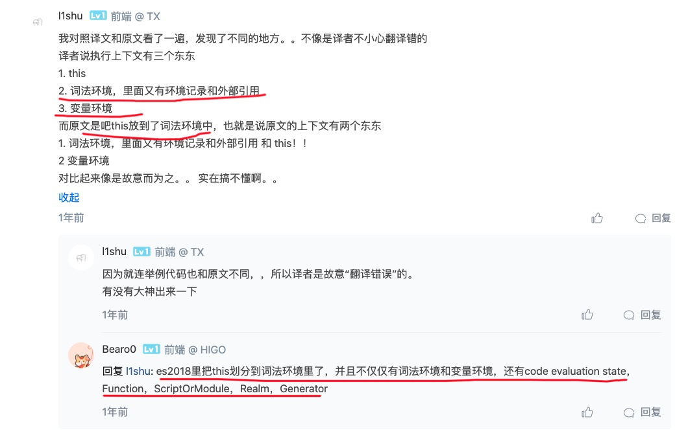
winter的重学前端
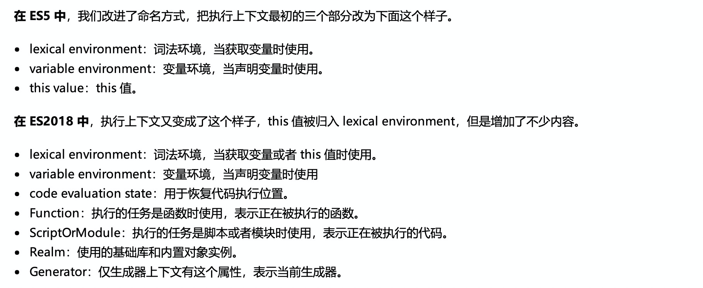

但，js用到了词法环境，词法环境是Js作用域的实现机制，通常叫变量的作用域查找机制。
词法环境是一种静态的词法环境，变量值来源和作用范围在代码创建时就决定好了。


词法环境（Lexical Environment）
1. 环境记录：存储变量和函数声明的实际位置
2. 对外部环境的引用：可以访问其外部词法环境

变量环境 
变量环境也是一个词法环境，因此它具有上面定义的词法环境的所有属性。
在 ES6 中，词法 环境和 变量 环境的区别在于
词法环境用于存储（ let 和 const ）声明的函数声明和变量，而变量环境仅用于存储（var）声明的函数和变量。
此处有变量、函数提升

- 执行阶段
  完成对所有变量的分配，最后执行代码。

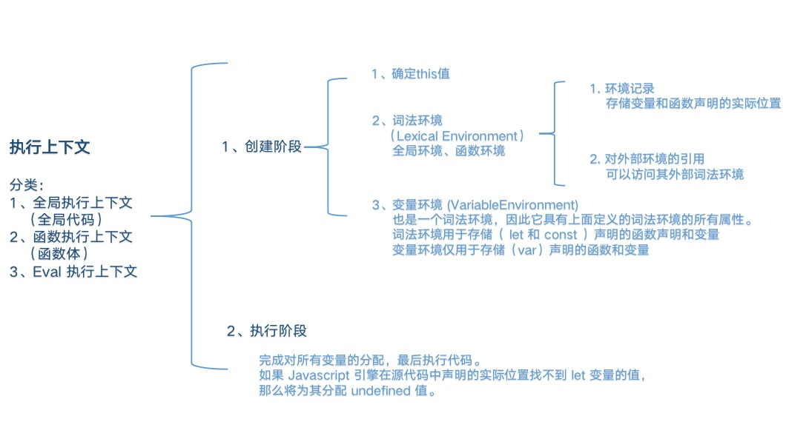


总结：
执行上下文，
决定了此范围里的所有的变量(显式的，引用的的，系统内置的)的来源，取值，赋值。


执行上下文栈（Execution Context）

函数多了，就有多个函数执行上下文，每次调用函数创建一个新的执行上下文，那如何管理创建的那么多执行上下文呢？
JavaScript 引擎创建了执行上下文栈来管理执行上下文。可以把执行上下文栈认为是一个存储函数调用的栈结构，遵循先进后出的原则。（LIFO，last in first out)

用例子说明，执行上下文栈

```javascript
let age = 18;
let name = 'will';
function sayHello() {
    let age = 25;
    let name = 'will02';
    function howYou() {
        let _age = age;
        console.log(`name = ${name}---age=${age}`);
    }
    howYou();
}
sayHello();

```
看图说话
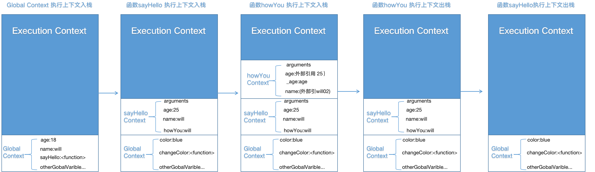


##### 变量（函数）提升与块级作用域
用代码说
```javascript

var getName = function() {
  console.log(4);
};
function getName() {
  console.log(5);
}
getName(); 

// -----我是华丽的分割线-------

getName();  
var getName = function() {
    console.log(4);
};
getName();
function getName() {
    console.log(5);
}

```


##### 变量提升/this/prototype/new 综合考察
```javascript

function foo() {
    getName = function () { 
       alert(1); 
    }
    return this;
}
    
foo.getName = function () { 
    alert(2); 
};

foo.prototype.getName = function () { 
    alert(3); 
};

var getName = function () { 
    alert(4); 
};

function getName() { 
    alert(5); 
}

foo.getName();     
getName();     
foo().getName();  
getName();   
new foo.getName(); 
new foo().getName(); 
new new foo().getName(); 

//https://developer.mozilla.org/zh-CN/docs/Web/JavaScript/Reference/Operators/Operator_Precedence
```
操作符优先级依据

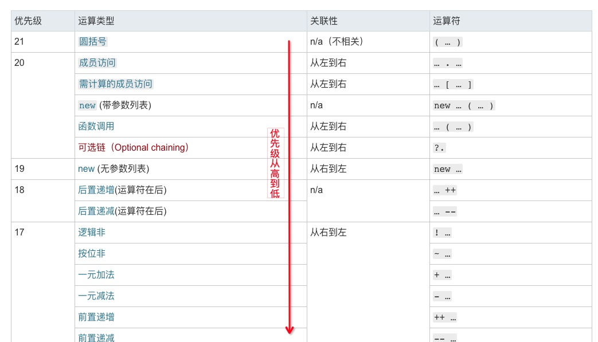

```javascript
//-------我是分割线-------

(function f() {
    function f() {
        return 1;
    }

    return f();

    function f() {
        return 2;
    }
})();
//-------我是分割线-------
//形参与变量同名问题，连等号问题

(function(b) {
    console.log(b);
    var b = c = 2;
    console.log(b);
})(1);

//-------我是分割线-------

(function(b) {
    console.log(b)
    var b = c = 2
    console.log(b)
    function b() {}
    console.log(b);
})(1)
```

```javascript
let name = 'outWill';
function test(){
    let name = 'will';
    //eval("(function(){ name = 'innerName'; console.log(name) })()");
    eval("console.log(`nameInEval = ${name}`)")
    console.log(`function name = ${name}`);
}
test();
console.log(`outName = ${name}`);
```

##### var 与 let差异
1. var 声明的变量，在其存在的执行上文中有变量提升的机制，未赋值时该变量可用.
   let 也有变量提升的机制，只是未赋值时不可用，因为临时死区限制.
   看例子

```javascript

function test(){
    if(n==4){
        n += 1;
    }else{
        //let n = 4;
        var n = 4;
    }
    console.log(`n=${n}`);
}
test();
```

2. let块级作用，在形如{}（打括号）里创建的变量，{}外无法访问。var却有穿透快级作用域的能力.

```javascript
console.log(`window--start, n=`,n);
if(true){
    var n = 10
    console.log(`if true`,n);
}

if(n>0){
    n++;
    console.log(`if n>0`,n);
}else{
    n = 11;
    console.log(`else n = 11`,n);
}

if(n===11){
    n++;
    console.log(`if n===11`,n);
}

console.log(`window--end, n=`,n);

//-----------------------------我是华丽的分割线------------------------------
console.log(`window--start, n=`,n);
//let n;
if(true){
    let n = 10
    console.log(`if true`,n);
}
if(n>0){
    n++;
    console.log(`if n>0`,n);
}else{
    n = 11;
    console.log(`else n = 11`,n);
}
if(n===11){
    n++;
    console.log(`if n===11`,n);
}
console.log(`window--end, n=`,n);

```
3. 块级作用域解决了for循环i值没发暂存的问题，块级作用域可以用来生产闭包

for()括号里面定义的内容视为大括号里面的内容
```javascript
function loop(){
    for(let i=0,len=5;i<len;i++){
    //for(var i=0,len=5;i<len;i++){
        setTimeout(()=>{
            console.log(i);
        },20)
    }
}
loop();

//----------------------------------------------------------------
//var 可以理解为
function loop(){
    var i = 0;
    var len = 5

    if(i<len){
        setTimeout(()=>{
            console.log(i);
        },20)
        i++;
    }
    if(i<len){
        setTimeout(()=>{
            console.log(i);
        },20)
        i++;
    }
    if(i<len){
        setTimeout(()=>{
            console.log(i);
        },20)
        i++;
    }
    if(i<len){
        setTimeout(()=>{
            console.log(i);
        },20)
        i++;
    }
    if(i<len){
        setTimeout(()=>{
            console.log(i);
        },20)
        i++;
    }
}
loop();
//----------------------------------------------------------------
//let用var替换可以理解为
function loop(){
    for(var i=0,len=5;i<len;i++){
        //如何创建快级作用域??,用函数
        (function(i){
            setTimeout(()=>{
                console.log(i);
            },20)
        })(i);
    }
}
loop();
```
看下babel对let的代码做了什么
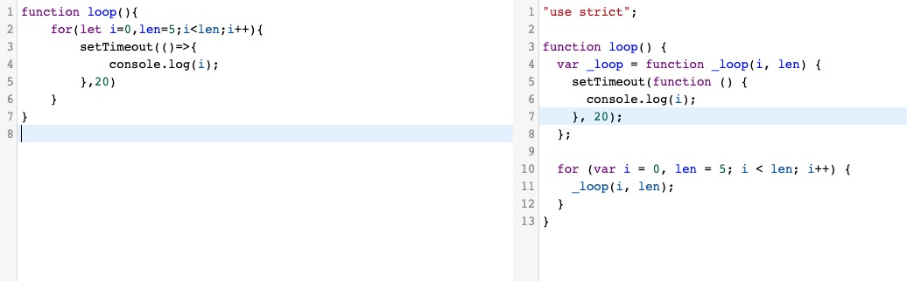

看一下方的这篇文章，到底说啥了？
https://zhuanlan.zhihu.com/p/28140450


#### 闭包
红宝书上对于闭包的定义：闭包是指有权访问另外一个函数作用域中的变量的函数
在全局作用域里，A函数返回(导出)B函数，B函数有权读写A函数里的变量，这种形式称之为闭包

最简单直白的形式:

```javascript
function aFn(){
    let n = 10;
    return function BFn(){
        console.log(`I can read and write variable n , n = ${n++}`);
    }
}
let bFn = aFn();
bFn();
bFn();
```

##### 闭包存在的形式

讨论闭包产生的条件:

1、作用域。
   根据词法作用域的的理论，函数的作用域是定义时就决定了。
   当一个函数不是定义在全局作用里（全局里的块级作用域除外），就有可能产生闭包，因为产生作用域嵌套，有嵌套就可以访问本层作用域的变量。

2、函数执行时，必须跳出定义时所在的作用域，一般是在全局作用域里执行。
   如何跳出定义时的作用域？
   1. 函数返回（最常见）
   2. 函数传递使用（如事件注册、回调函数）
   3. 关联对象引用
   4. 自执行函数

根据以上2个产生条件说说闭包存在的形式:

1. 函数返回，参见以上。
2. 函数传递使用（如事件注册、回调函数）
看例🌰
```javascript

function aFn(){
    let n = 10;
    let show = document.getElementById('myshow');
    let btn01 = document.getElementById('btn01');
    let handClick01 = ()=>{
        console.log(`when I am clicked, n = ${n++}`);
        show.innerText = n;
    };
    btn01.addEventListener('click',handClick01,false);

    /*
    let btn02 = document.getElementById('btn02');
    let handClick02 = ()=>{
        console.log(`when I am clicked, n = ${n++}`);
        show.innerText = n;
    };
    btn02.addEventListener('click',handClick02,false);
    */
}

aFn();

//----------------关联对象引用--------------------
```
3. 对象引用,导出函数
``` javascript
let obj = {};
function aFn(){
    let n = 10;
    obj.bFn = ()=>{
        console.log(`n = ${n++}`);
    }
}
//依赖a的执行
aFn();
//这明显就不是纯函数
obj.bFn();
obj.bFn();
obj.bFn();
```
4. 自执行函数

```javascript
for(var i=0,len=5;i<len;i++){
    setTimeout(()=>{
        console.log(i);
    },1000*i)
}


//-------闭包-------

for(var i=0,len=5;i<len;i++){
    (function(i){
        setTimeout(()=>{
            console.log(i);
        },1000*i)
    }(i))
}

```

自执行函数本质上不算闭包，只是建立一个函数，函数确定了作用域，驻守了一块作用域罢了。每生产一个函数就产生了一个函数执行行上下文，保护了参数。一定要说是闭包的话，可理解为一次性闭包。
以上代码可该为
```javascript
for(var i=0,len=5;i<len;i++){
    var fn = (n)=>{
        setTimeout(()=>{
            console.log(n);
        },1000*n)
    }
    fn(i); 
}
```
除了以上，就没其他形式的闭包了么,一定要2个函数？
##### ES6块级作用域，产生的函数（原创，待确认）
```javascript
let aFn = null;
{
    let n = 10;
    aFn = ()=>{
        console.log(`n = ${n++}`);
    }
}

aFn();
aFn();
aFn();


//------循环闭包-------
let obj = {};
for(let i=0,len=5;i<len;i++){
    obj[`fun${i}`] = function(){
        console.log('i have magic ',i++);
    }
}
console.log('one--obj',Object.keys(obj));
obj['fun0']();
obj['fun0']();
obj['fun0']();


obj['fun1']();
obj['fun1']();
obj['fun1']();

//ES6 的循环里已经有作用域了，一般不要定义函数！！！

```
问题：ES5可以产生以上效果(5个闭包)么，为什么？

##### 闭包的应用

1. 封装，将使用看不到的东西保存闭包里，只提供有用的方法
   比如，对防抖/节流函数的封装，后面详述，此处略过
   js高级一点封装，基本都要用到闭包.
   实现类的私有对象。

2. 包装  如React高级组件\bind函数的实现
   https://www.jianshu.com/p/0aae7d4d9bc1

3. 保护变量  
   缓存数据(页面点击已经)、柯里化(后面详述)。

类的私有属性闭包实现
```javascript
let Person  = (()=>{
    let age = 19;
    class PersonInner{
        constructor(){
            this.name = name;
        }
        getAge(){
            return age;
        }
        updateAge(n){
            return age += n;
        }
    }
    return PersonInner;
})();

//-------------我是分割---------------消耗内存
function Person(name){
    let age = 19;
    this.name = name;

    this.getAge = function(){
        return age;
    }

    this.updateAget = function(num){
        return age += num;
    }
}

```


#### 事件循环机制
关键词:macro-task(宏任务):script 、setTimeout、setInterval 、setImmediate 、I/O 、UI rendering
micro-task(微任务) MutationObserver、Promise.then()或reject()
Mutation Observer API 用来监视 DOM 变动。比如节点的增减、属性的变动、文本内容的变动。
先从一道题目进入
```javascript
console.log(0);

setTimeout(()=>{
    console.log(1);
},0);

console.log(2);

new Promise((resolve,reject)=>{
    console.log(3);
    setTimeout(()=>{
        console.log(4);
    },0);
    resolve();
}).then(()=>{
    console.log(5);
    setTimeout(()=>{
        console.log(6);
    },0);
}).then(()=>{
    console.log(7);
});
console.log(8);
```

分析:
主线称同步任务队列,从上到下:
```javascript
console.log(0);
console.log(2);
console.log(3);
console.log(8);
//------异步队列---微任务---
console.log(5);
console.log(7);
//------异步队列---宏任务---
console.log(1);
console.log(4);
console.log(6);
```

比较
```javascript

setTimeout(()=>{
    console.log(0);
})

new Promise((resolve,reject)=>{
    console.log(4);
    reject(5);
}).catch((e)=>{
    console.log(`e=${e}`);
})

new Promise((resolve,reject)=>{
    console.log(1);
    resolve();
}).then(()=>{
    console.log(2);
})

console.log(3);

```

vue next-tick更新视图异步原理之微任务的应用：
https://github.com/vuejs/vue/blob/dev/src/core/util/next-tick.js

React setState 更新是通过 batchedUpdates 标识进行，默认是合并更新，进入异步循环里，batchedUpdates会被置为false,可以同步更新了。
https://zhuanlan.zhihu.com/p/78516581

js代码执行循序优先按，主线程同步队列、异步线程微任务、异步线程宏任务的顺序，执行。
同步队列先执行完，不管任务有多长，完毕；将微任务队列加入同步任务队列，执行完毕；将异步任务队列加入同步任务队列,执行之.................

1、如果在执行微任务过程中有新的微任务如何排队
新的微任务在同步任务队列执行完毕，继续加入同步任务队列，不会执行异步任务队列的
例子
```javascript

setTimeout(()=>{
    console.log('macro-task---000001');
});
new Promise((resolve,reject)=>{
    resolve()
}).then(()=>{
    console.log('micro-task--001');
    return Promise.reject();
}).catch(e=>{
    console.log('micro-task--002');
});

```

2、如果如果宏任务执行过程中产生新的微任务如何排队
```javascript
setTimeout(()=>{
    console.log('macro-task-001');
    Promise.resolve().then(()=>{
        console.log(`macro-task-001==>new micro-task-001`);
        setTimeout(()=>{
            console.log(`macro-task-001==>new micro-task-001==>macro-task-001`);
        },0)
    });
});

setTimeout(()=>{
    console.log('macro-task-002');
});

setTimeout(()=>{
    console.log('macro-task-003');
});
```


#### 异步  Promise\yield\Generator\async\await

先看先如果不用promise 或 async\await,我们所遇到的问题

先异步取列表信息，再异步取id信息,再取我们要的detail信息. 然后展开业务代码,代码模拟嵌套如下:
```javascript 

setTimeout(()=>{
    let list = [{name:'will',age:18}];
    setTimeout(()=>{
        let id = '12123132';
        setTimeout(()=>{
            let details = {};
            //here we can do out biz task .......
        },1000)
    },1000)
},1000);

```
此所谓地狱回调(callback hell)问题.

Promsie的解决方案:
```javascript

new Promise((resolve,reject)=>{
    //task A
    setTimeout(()=>{
        let list = [{name:'will',age:18}];
        resolve(list);
    },1000);
}).then(list=>{
    return new Promise((resolve,reject)=>{
        //task B
        console.log(`I get list data= ${JSON.stringify(list)}`);
        setTimeout(()=>{
            let id = '12123132';
            resolve(id);
        },1000);
    });
}).then(id=>{
    //task C
    console.log(`I get list data ${id}`);
    setTimeout(()=>{
        let details = {};
        //here we can do out biz task .......
        //.......
    },1000);
});

```
将一个异步的函数代码块封装成一个Promise对象 
```javascript
new Promise((resolve,reject)=>{
    // 执行异步代码块
    // 成功完成后用执行resolve()
    // 失败就执行reject(),程序内部会抛错，需要catch
}).then(data=>{

},e=>{
    console.log(`failed`);
}).catch(e=>{
    console.log(`i ma catch ${e}`);
})
```

Prmise的基本规则：

1、promise构造函数里执行异步或同步代码,通过resolve,或reject扭转promise的状态，状态扭转之后不可更改。

2、resolve执行时需传一个值value，该值可以在then的第一个回调函数里接受，并执行onFulFilled

3、reject执行时需传一个值reason,该reason可以在then的第二个回调函数里接受并执行onFailed，如何onFailed未定则忽略，直到找到catch方法，捕获该错误。不然报错.

4、catch捕获错误或,reject抛出的错误 

看看标准里怎么规定的

##### promsie A/+ 标准

https://promisesaplus.com/
https://segmentfault.com/a/1190000002452115

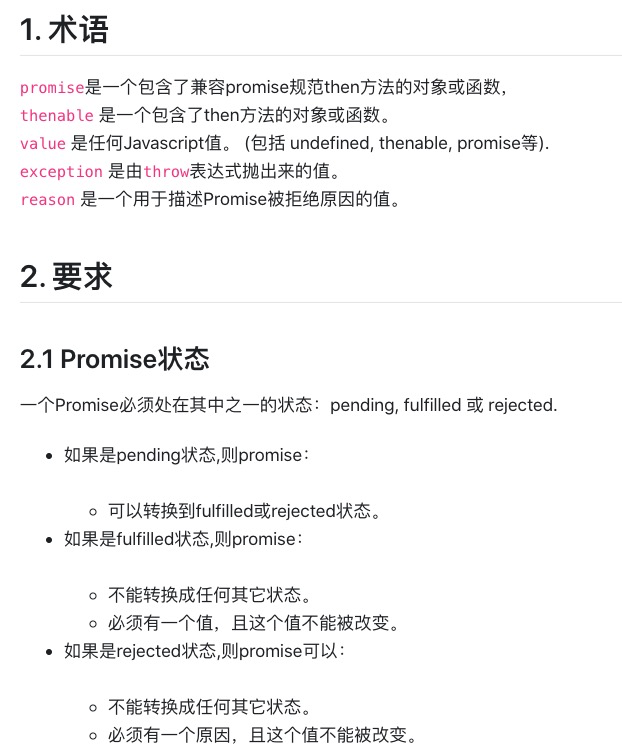
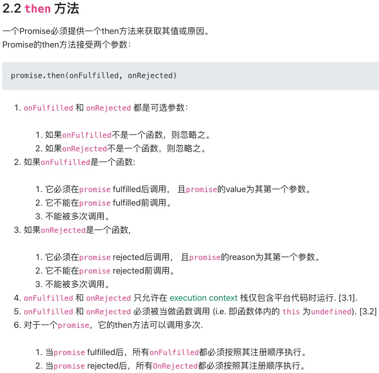
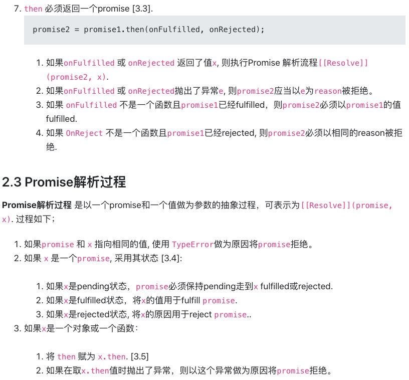
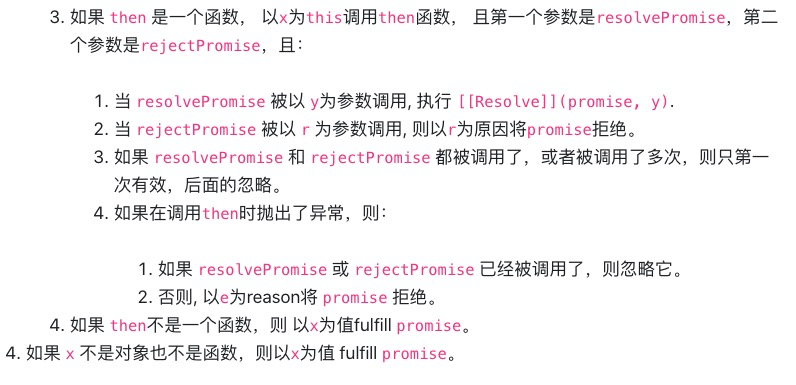


下面，简单实现下Promise的基本款

```javascript
function MyPromise(executor){
    this.statusMap = {
        pending:'PENDING',
        fufilled:'FULFILLED',
        rejected:'REJECTED'
    }

    this.value;
    this.reason;
    this.status = this.statusMap.pending;
    this.onFulfilled = null;
    this.onRejected  = null;
    this.catchFn = null;

    var self = this;
    try{
        executor(this.resolve.bind(this),this.reject.bind(this));
    }catch(e){
        //this.catch(e);
        this.reject(e);
    }
    
    //后面有挂载then自动执行
}

MyPromise.prototype ={
    constructor:MyPromise,
    resolve(value){
        if(this.status === this.statusMap.pending){
            this.value = value;
            setTimeout(()=>{
                var result;
                if(typeof this.onFulfilled === 'function'){
                    try{
                        result = this.onFulfilled(this.value);
                        this.nextPromise.resolve(result);
                    }catch(e){
                        this.nextPromise.reject(e);
                    }
                }
            });
        }
    },
    reject(reason){
        if(this.status === this.statusMap.pending){
            this.reason = reason;
            setTimeout(()=>{
                try{
                    if(typeof this.onRejected === 'function'){
                        var failResult = this.onRejected(this.reason);
                        this.nextPromise.resolve(failResult);
                    }else{
                        this.exeCatch(reason);
                    }
                }catch(e){
                    this.exeCatch(e);
                }
            });
        }
    },
    then(onFulfilled,onRejected){
        this.onFulfilled = onFulfilled;
        this.onRejected = onRejected;
        this.nextPromise = new MyPromise((resolve,reject)=>{

        });
        return this.nextPromise;
    },
    exeCatch(e){
        var current = this;
        while(current){
            if(typeof current.catchFn === 'function'){
                current.catchFn(e);
                current = null;
            }else{
                current = current.nextPromise?current.nextPromise:null;
            }
        }
    },
    catch(catchFn){
        this.catchFn = catchFn;
    }
}
// ---------  以下是测试 --------------------
new MyPromise((resolve,reject)=>{
    reject(1)
}).then(data01=>{

},reason01=>{
    console.log(`reason01 = ` + reason01);
    return 22
}).then(data03=>{
    console.log(`data03 = ${data03}`);
    afa;
}).catch(e=>{
    console.log(e);
});

```

promise是解决回调地狱的核心，但是没有彻底解决异步问题，把异步当同步使用，于是async,await出现了。
看例子:
```javascript
function doSomething(){
    console.log('do some thing here~~');
}


setTimeout(()=>{
    let data01 = {data:'i am data011111'};
    setTimeout(()=>{
        let data02 = {data:'i am data02222222'};
        doSomething();
    },2000);
},1000);

//-----------以下用async await 实现-----------------

function getData01(){
    return new Promise((resolve,reject)=>{
        setTimeout(()=>{
            resolve({data:'i am data011111'})
        },1000);
    });
}

function getData02(data01){
    return new Promise((resolve,reject)=>{
        setTimeout(()=>{
            resolve({data:'i am data02222222'})
        },1000);
    });
}

async function doBiz(){
   let data01 = await getData01();
   let data02 = await getData02(data01);
   doSomething();
}

```

await关键字后面必须是个Promise,如果不是会被自动封装成Promise.resolve的结果,await所在的函数里外必须加async关键字，所以async/await是成成出现的。
特点：
1. await在全局执行栈里不能使用,必须是函数里，async/await是成成出现的。
2. 有了async/await就可以抛弃promise了么？谁比谁有优势，谁会取代谁？
   并不是，await后面必须跟Promise对象，如果不是，会自用Promise.resolve()包装（或一个微任务）。async await依赖于Promise
```javascript
    function getData01(){
        return {name:'will'}
    }

    async function doBiz(){
        let data01 = await getData01();
        console.log(JSON.stringify(data01));    
    }

    doBiz();

    new Promise((resolve,reject)=>{
        console.log('before 222222222');
        resolve(222)
    }).then(data=>{
        console.log(data);
    })


    //---------------一道题-----微任务--------------------------------------------
    async function async1() {
        console.log("async1 start");
        await async2();
        console.log("async1 end");
    }

    async function async2() {
        console.log("async2");
    }

    console.log("script start");

    setTimeout(function() {
        console.log("setTimeout");
    }, 0);

    async1();

    new Promise(function(resolve) {
        console.log("promise1");
        resolve();
    }).then(function() {
        console.log("promise2");
    });

    console.log("script end");

```
3. await 后面的是同步执行，后面的微任务异步

缺点：
1. async/awiat 地狱连环套

```javascript
    function getData01(){
        new Promise((resolve,reject)=>{
            setTimeout(()=>{
                resolve({name:'will'});
            },1000);
        }).catch(e=>{
            [err]
        })
    }

    async function doBiz(){
        let data01 = await getData01();
        return data01;
    }

    let mydata = doBiz();
    console.log(mydata);

```

2. 如果不捕获错误则代码阻塞，异常捕获 try catch 或await-to-js 解决报错
https://blog.csdn.net/xjl271314/article/details/79566447
```javascript
//体会await-to-js 如何优雅的处理错误的
export default function to(promise) {
   return promise.then(data => {
      return [null, data];
   })
   .catch(err => [err]);
}
```

使用场景:
异步操作，后续流程依赖不强，可以用。
复制流程的中间环节，慎用async await,不然全世界都变成了异步函数了。

##### async await 怎么实现的，如何手动实现一个


可以暂停代码，这个有点玄.....
##### generator yield 
```javascript
const getData = () => new Promise(resolve => setTimeout(() => resolve("data"), 1000));

function* helloWorldGenerator() {
    yield getData();
    yield 'two';
    return 'three';
}

let fn = helloWorldGenerator();
console.log(fn.next());
console.log(fn.next());
console.log(fn.next());
console.log(fn.next());
console.log(fn.next());


//-------------Promsie generator- return--------------------

const getData = (data)=>{
    return new Promise(resolve => {
        console.log(data);
        setTimeout(() => {
            resolve("data")
        }, 1000);
    });
}

function* generatorFn() {
    console.log('00000');
    let data01 = yield getData('one yield~~~');
    console.log(`one next execute .....data01 = ${data01}`);

    let data02 = yield getData(`two yield~~~`);
    console.log(`two next execute .....data02 = ${data02}`);

    return 'i am last one';
}

let fn = generatorFn();


//------------
function* helloWorldGenerator() {
    yield 'one';
    yield 'two';
    yield 'three';
}

```

代码似乎可以暂停了，如何封装成async\await呢
```javascript
//---------------场景-------------
const getData = () => new Promise(resolve => setTimeout(() => resolve("data"), 1000));

async function test() {
    const data = await getData()
    console.log('data: ', data);
    const data2 = await getData()
    console.log('data2: ', data2);
    return 'success'
}

let gen = test();
let data = gen.next();
console.log(data);
let data2 = gen.next();
console.log(`data02=${data02}`);

lastData = gen.next();
console.log(`lastData=${lastData}`);


// 这样的一个函数 应该再1秒后打印data 再过一秒打印data2 最后打印success
test().then(res => console.log(res))

//-------------------------华丽的分割线------------------------------


const getData = () => new Promise(resolve => setTimeout(() => resolve("data"), 1000));

function* testG(){
    const data = yield getData();
    console.log(`data:${data}`);
    const data2 = yield getData();
    console.log(`data2:${data2}`);
    return 'success';
}

var gen = testG();
var dataPromise = gen.next();

dataPromise.then(value1=>{
    var data2Promise = gen.next(value1);
    data2Promise.value.then(value2=>{
        gen.next(value2);
    })
});


//------------------generator封装----------------------
```

#### IIFE(立即执行函数)、高阶函数、惰性函数、函数柯里化

##### IIFE  （Imdiately Invoked Function Expression 立即执行的函数表达式）

```javascript
;(function(){

})();

console.log(n);
```
形如以上，的形式我们称之为IIFE.
某些库里首个字符可以能是(;/+/-!), 因为js允许不加;结束,为了避免代码与上一行未加;的语句隔离开，加符号(;/+/-!)隔离.


作用:
1、创建了一个内部作用域，表达式内只执行一次，(通过参数传递变量)减少变量查找
这里有闭包么？
```javascript
//1、es5一个经典的场景,如何每隔一秒输出一个i,i取值0，1，2，3，4，5
//2、更短代码实现
for(var i=0,len=5;i<len;i++){
    setTimeout(function(){
        console.log(i);
    },1000);
}


//----------------- [ 方法一] ----------------------------------

for(var i=0,len=5;i<len;i++){
    //内存释放了
    (function(i){
        setTimeout(function(){
            console.log(i);
        },1000*i);
    })(i);
}

//----------------- [ 方法二 ] ---------------------------------

```
2、有全局长拼写参数时，利于压缩
```javascript
function(w, d, $) {  
    // You can now reference the window, document, and jQuery objects in a local scope  
}(window, document, window.jQuery); 
```

3、避免全局命名冲突


4、单纯的方便逻辑处理

```javascript
let column = [
    {
        name:'one'
    },(()=>{
        let name = Math.random()>0.5?'jack':'pony';
        console.log( `name = ${name} ` );
        return {
            name
        }
    })()
];
console.log(column);
```


```javascript 
var fn = null;

;(function(){
    var  n= 1;
    fn = function(){
        console.log(n+m);
        n++;
        m++;
    }
    var m = 5;
})();
```

##### 高阶函数 (Higher-order function)
基本定义:能够接收函数作为参数或将函数作为输出返回，这里的函数称之为高阶函数
常见的:map/reduce/filter/sort
```javascript
let arr = [{age:19},{age:89},{age:45},{age:13}];
//map输入一个函数，更具函数的返回确定一个新的数组
let arr02 = arr.map(item=>{
    return item.age>45?item.age:45;
});
console.log(arr02);

//-----reduce 遍历少一次，第一个参数是上次函数返回的结果，第一次默认用第一个元素

let arr = [1, 3, 5, 7, 9];
let lastResult = arr.reduce(function (x, y, i) {
    console.log(`x = ${x}--y=${y}--i=${i}`);
    return (x + y)*2;
});
console.log(`lastResult = ${lastResult}`);

//let total 
let preResult = arr[0];
for(let i=1,len=arr.length; i<len; i++){
    preResult = (function(x,y,i){
        console.log(`x = ${x}--y=${y}--i=${i}`);
        return (x + y)*2;
    })(preResult,arr[i],i);
}
console.log(`preResult = ${preResult}`);


//---------  reduce for mySelf  --------------------------

Array.prototype.myReduce = function(fn){
    let arr = this;
    let preResult = arr.length>0?arr[0]:0;
    for(let i=1,len=arr.length; i<len; i++){
        preResult = fn(preResult,arr[i],i);
    }
    return preResult;
}

//-----------------------------------------------------

//reduce
let total = arr.reduce((one,two)=>{
    return {age:(one.age + two.age)}
});
console.log(`total = ${total.age}`);


//filter输入一个函数，根据函数的条件，提出某些元素
let arr = [{age:19},{age:89},{age:45},{age:13}];
arr.filter(item=>{
    return item.age>=45
});

//sort ，根据函数的条件，排序
let arr = [{age:19},{age:89},{age:45},{age:13}];
arr.sort((one,two)=>{
    return one.age-two.age;
});
```

##### 惰性函数
惰性函数的本质就是函数重写。
当函数内部执行的分支判断或逻辑总是返回相同的结果，执行一次即可，然后重写函数，跳过之前的计算。直接进入当前的分支或得到结果。

如浏览器检测的判断，每次结果肯定相同，则
```javascript
function whichOne(){
    var userAgent = navigator.userAgent; //以下演示代码，判断结果不做保证

    //判断是否Opera浏览器
    if (userAgent.indexOf("Opera")) {
        return "Opera"
    }; 
    //判断是否Firefox浏览器
    if (userAgent.indexOf("Firefox") > -1) {
        return "FF";
    } 
    //判断是否chorme浏览器
    if (userAgent.indexOf("Chrome") > -1){
		return "Chrome";
    }
    //判断是否Safari浏览器
    if (userAgent.indexOf("Safari") > -1) {
        return "Safari";
    }
}


//----------重写-----

function whichOne(){
    var userAgent = navigator.userAgent; //以下演示代码，判断结果不做保证
    var reWrite = (result)=>{
        whichOne = function(){
            return result;
        }
        return result;
    }
    console.log(11111);
    //判断是否Opera浏览器
    if (userAgent.indexOf("Opera")) {
        return reWrite("Opera");
    }; 
    //判断是否Firefox浏览器
    if (userAgent.indexOf("Firefox") > -1) {
        return reWrite("FF");
    } 
    //判断是否chorme浏览器
    if (userAgent.indexOf("Chrome") > -1){
		return reWrite("Chrome");
    }
    //判断是否Safari浏览器
    if (userAgent.indexOf("Safari") > -1) {
        return reWrite("Safari");
    }
}

//------------------事件注册-------------------------------
function addEvent (type, element, fun) {
    if (element.addEventListener) {
        element.addEventListener(type, fun, false);
    }else if(element.attachEvent){
        element.attachEvent('on' + type, fun);
    }else{
        element['on' + type] = fun;
    }
}
//-----------重写------------------
function addEvent (type, element, fun) {
    if (element.addEventListener) {
        addEvent = function (type, element, fun) {
            element.addEventListener(type, fun, false);
        }
    }else if(element.attachEvent){
        addEvent = function (type, element, fun) {
            element.attachEvent('on' + type, fun);
        }
    }else{
        addEvent = function (type, element, fun) {
            element['on' + type] = fun;
        }
    }
    addEvent(type, element, fun);
}

//------------------实现单例子-----------------------
function Person() {

    // 缓存的实例
    var current = this;

    // 其它内容
    this.name = 'will';
    this.age = "12";

    // 重写构造函数
    Person = function () {
        return current;
    };
}

let one = new Person(); //
let two = new Person();

```

##### 函数柯里化
一个函数接受多个参数，变换成接受单一参数返回新的函数接受单一参数，如此重复直到参数和函数匹配完毕，返回结果。这样处理的方式称之为函数的柯里化。


最简单形式的理解：
```javascript
// 普通的add函数
function add(x, y) {
    return x + y
}

// Currying后
function curryingAdd(x) {
    return function (y) {
        return x + y
    }
}

add(1, 2)           // 3
curryingAdd(1)(2)   // 3


```
作用
1. 通过闭包，参数复用(也是闭包的用处)

```javascript
function check(reg,txt){
    return reg.test(txt);
}

check(/\d+/g,'test');
check(/[a-a]+/g,'test');


function curryingCheck(reg) {
    return function(txt) {
        return reg.test(txt)
    }
}

var hasNumber = curryingCheck(/\d+/g)
var hasLetter = curryingCheck(/[a-z]+/g)

hasNumber('test1')      // true
hasNumber('testtest')   // false
hasLetter('21212')    
hasLetter('23ae312') 
```

2. 延迟执行


```javascript

function curry(fn,len){
    let args = [];
    let innerFun = ()=>{
        let curArgs = Array.from(arguments);
        args = args.concat(curArgs);
        if(args.length>=len){
            return fn.apply(null,args);
        }else{
            return innerFun;
        }
    }
    return innerFun;
}

```

看一道题,实现以下功能
```javascript
// 实现一个add方法，使计算结果能够满足如下预期，按此模式可以无限扩展：
add(1)(2)(3) = 6;
add(1, 2, 3)(4) = 10;
add(1)(2)(3)(4)(5) = 15;
//...

```
//-----------------------------
//分析;
1.函数执行次数不固定
2.算法将各参数相加返回结果
3.难点,返回执行函数个数不固定，为什么可以得到值，不应该是函数本事么？
4.重新写toString方法，会怎样?

```javascript

function myFn(){

}
myFn.toString = function(val){
    return val?val:0;
}

console.log(myFn);
```
写
```javascript
function add(first){
    let total = first;
    let innerFn  = function(){
        //转数组
        //[].slice.apply(arguments);
        let args = Array.from(arguments);
        total += args.reduce((one,two)=>{
            return one + two;
        });
        return innerFn;
    }
    innerFn.toString = ()=>{
        return total;
    }
    return innerFn;
}

console.log(add(1)(2)(3,4,5)(4)(5));

```


12、其他
    节流/防抖 throttle doubance

### 防抖 debouce

【自定义】：事件触发时延时执行，如果持续触发则清空之前的定时器，重新建立定时器。
使用场景，滚动条触发事件，窗口大小改变事件，持续触发事件
（提交数据点击按钮可用按钮封锁实现）
防抖自我实现代码，
input输入实时搜索,resize,scroll,下拉加载，字面上理解节省流量。
最后一次一定执行！！！
在一段时间内只执行一次，这里的【一段时间】不是一个定值，随之执行频率不断增加。
##### 业务场景代码，不封装
``` javascript
biz();
function biz(){

    //原始函数,没有防抖，消耗性能
    let scrollHandler01 = (e)=>{
        console.log(`e=${e}--this=${this}`);
    }

    //业务场景下的处理，代码处理
    let scrollTimer = null;
    let wait = 100;
    let scrollHandler02 = (e)=>{
        if(scrollTimer){
            //清除定时器，建立新的定时器
            clearTimeout(scrollTimer);
        }
        //建立新的定时器
        scrollTimer = setTimeout(()=>{
            scrollHandler01(e);
            scrollTimer = null;
        },wait);
    }

    window.addEventListener('scroll',scrollHandler02);

    
    //抽取封装功能,必须用定时器写防抖，不能用时间间隔 
    function myDebounce(fun,wait,context=this){
        let deBouceTimer = null;
        return ()=>{
            if(deBouceTimer){
                clearTimeout(deBouceTimer); 
            }
            deBouceTimer = setTimeout(()=>{
                fun.apply(context,arguments);
                deBouceTimer = null;
            },wait);
        }
    }

    //原始函数,没有防抖，消耗性能
    let scrollHandler01 = (e)=>{
        console.log(`e=${e}--this=${this}`);
    }

    window.addEventListener('scroll',myDebounce(scrollHandler01,100));

}
```


### 节流函数

input输入时时搜索,一定时间内执行一次。
节流函数，节省流量


```javascript 
//业务场景，代码不封装,直接在业务里
var someBizFun = ()=>{
    console.log('give a request!');
}

let bizExeTimes = 0;
let startTime = Date.now();
let step = 100;
let isFirst = true;
let currentTime = null;

let bizTimer = setInterval(()=>{
    currentTime = Date.now();
    bizExeTimes++;
    if(bizExeTimes>=1000){
        clearInterval(bizTimer);
    }

    if(!isFirst){
        isFirst = false;
        someBizFun();
    }else if(currentTime-startTime>=step && !isFirst){
        someBizFun();
        startTime = currentTime;
    }
    /*
    setTimeout(()=>{
        exeFun();
    },30)
    */
},20);

```


``` javascript
//抽取通用的绑定
function myDebounce01(func,ms= 500,immediate=true,context=this){
    let lastTime = 0;
    return ()=>{
        let afterMsExe = ()=>{
            let currentTime = new Date().getTime();
            if(currentTime - lastTime>=ms){
                func.apply(context,arguments);
                lastTime =  currentTime;
            }
        };
        if(immediate){
            //立即执行函数,用闭包、时间差对比
            if(lastTime === 0){
                func.apply(context,arguments);
                lastTime = new Date().getTime();
            }else{
                afterMsExe();
            }
        }else{
            afterMsExe();
        }
    }
}


//用new Date和 setTimeout实现
function myDebounce02(func,ms=500,immediate=true,context=this){
    let lastTime = 0;
    let timer = null;
    return ()=>{
        if(immediate){
            //立即执行函数,用闭包、时间差对比
            if(lastTime === 0){
                func.apply(context,arguments);
                lastTime = new Date().getTime();
            }else{
                let currentTime = new Date().getTime();
                if(currentTime - lastTime>=ms){
                    func.apply(context,arguments);
                    lastTime =  currentTime;
                }
            }
        }else{
            //延时执行....
            if(!timer){
                timer = setTimeout(()=>{
                    func.apply(context,arguments);
                    timer = null;
                },ms);
            }
        }
    }
}
```


### 测试 节流函数，单位时间内执行一次,触发时间越长执行次数越多
``` javascript
//validate
function test(){
    clickFun.times = 0;
    function clickFun(){
        clickFun.times++;
        console.log('I am click, times=' + clickFun.times);
    }
    //包裹成新的防多次执行函数,
    let clickFunNew = myDebounce02(clickFun,1000);
    let allTimes = 0;
    let bizTimer = setInterval(()=>{
        clickFunNew();
        allTimes ++;
        if(allTimes>=100){
            clearInterval(bizTimer);
        }
    },50);
}
test();
```


13、javascript 内存回收机制


