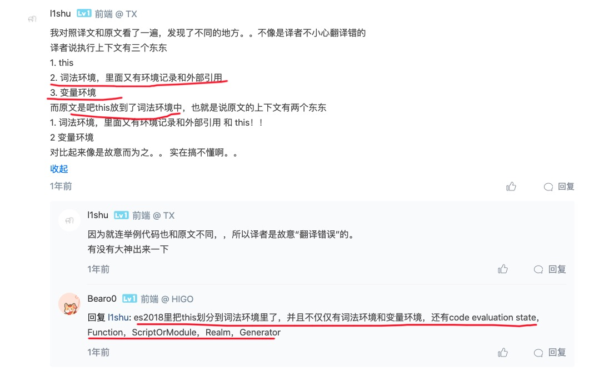
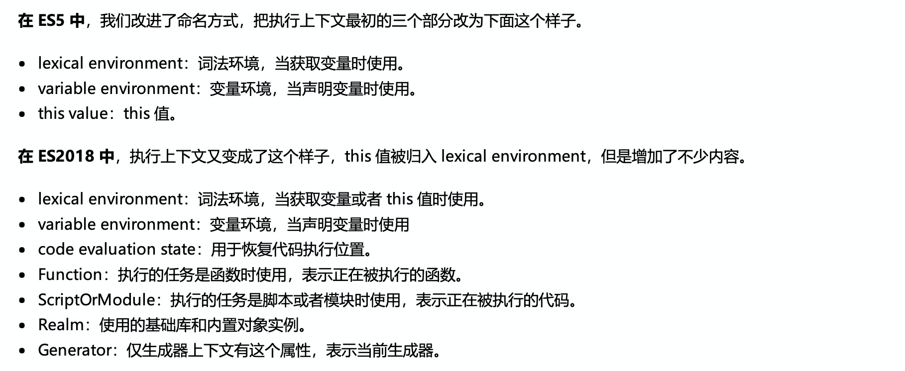

### 前端知识体系之__深入理解 javascript

#### 代码的执行过程解析

关键词:

执行上下文、执行栈、词法环境、作用域、作用域链、变量提升、左查找、右查找
Execution Contexts\execution stack\ LexicalEnvironment\ scope \scope chain \ hoisting\LHS\RHS

###### 执行过程
1、词法分析 
2、语法分析 AST
3、创建执行上下文、执行上下文栈
4、执行代码


##### 执行上下文（Execution Context）

定义：执行上下文就是当前 JavaScript 代码被解析和执行时所在环境的抽象概念， JavaScript 中运行任何的代码都是在执行上下文中运行。


执行上下文的分类:
1. 全局执行上下文（全局代码）
当代码被执行时，全局执行上下文即被创建。不在任何函数中的代码都位于全局执行上下文中，只有一个，浏览器中的全局对象就是 window 对象，this 指向这个全局对象。

2. 函数执行上下文（函数体）
只有调用函数时，才会为该函数创建一个新的执行上下文，可以存在无数个，每当一个新的执行上下文被创建，它都会按照特定的顺序执行一系列步骤。

3. Eval 执行上下文（eval代码）
融入型的作用域。eval代码块放在哪里就代码就融入到哪里。遵守所在位置的执行上下文规则，eval里的变量访问所在上下文的变量


##### 执行上下文有创建和执行的2个步骤：


- 创建阶段

``` javascript

//举例代码
let a = 20;
const b = 30;
var c;
function multiply(e, f) {
    var g = 20;
    return e * f * g;
}
c = multiply(20, 30);


//创建阶段
GlobalExectionContext = {
    LexicalEnvironment = <ref. to LexicalEnvironment in memory>,
    VariableEnvironment = <ref. to VariableEnvironment in  memory>,
}


Each Lexical Environment 包括：
1、该环境内的let\const\function 的标识符或值
2、外部环境的关联（作用域链）
//Reference to the outer environment,
3、this值的绑定
//This binding.
```

```javascript
//全局执行上下文
GlobalExectionContext = {
    // this绑定为全局对象
    ThisBinding: <Global Object>,
    //词法环境
    LexicalEnvironment: {  
      //环境记录
      EnvironmentRecord: {  
        Type: "Object",  // 对象环境记录
        // 标识符绑定在这里 let const创建的变量a b在这
        a: < uninitialized >,  
        b: < uninitialized >,  
        multiply: < func >  
      },
      // 全局环境外部环境引入为null
      outer: <null>  
    },
  
    VariableEnvironment: {  
      EnvironmentRecord: {  
        Type: "Object",  // 对象环境记录
        // 标识符绑定在这里  var创建的c在这
        c: undefined,  
      }
      // 全局环境外部环境引入为null
      outer: <null>  
    }  
  }


  
  // 函数执行上下文
  FunctionExectionContext = {
     //由于函数是默认调用 this绑定同样是全局对象
    ThisBinding: <Global Object>,
    // 词法环境
    LexicalEnvironment: {  
      EnvironmentRecord: {  
        Type: "Declarative",  // 声明性环境记录
        // 标识符绑定在这里  arguments对象在这
        Arguments: {0: 20, 1: 30, length: 2},  
        e:Arguments[0],
        f:Arguments[1]
      },  
      // 外部环境引入记录为</Global>
      outer: <GlobalEnvironment>  
    },
  
    VariableEnvironment: {  
      EnvironmentRecord: {  
        Type: "Declarative",  // 声明性环境记录
        // 标识符绑定在这里  var创建的g在这
        g: undefined  
      },  
      // 外部环境引入记录为</Global>
      outer: <GlobalEnvironment>  
    }  
}
```


  
In ES6, one difference between LexicalEnvironment component and the VariableEnvironment component is that the former is used to store function declaration and variable (let and const) bindings, while the latter is used to store the variable (var) bindings only.


但，js用到了词法环境，词法环境是Js作用域的实现机制，通常叫变量的作用域查找机制。
词法环境是一种静态的词法环境，变量值来源和作用范围在代码创建时就决定好了。

变量对象与活动对象的概念是ES3，是老概念


词法环境（Lexical Environment）
1. 环境记录：存储变量和函数声明的实际位置
2. 对外部环境的引用：可以访问其外部词法环境
3. this值的确定

变量环境 (variable Environment）
1. 环境记录：存储变量和函数声明的实际位置
2. 对外部环境的引用：可以访问其外部词法环境
3. this值的确定

区别：


变量环境也是一个词法环境，因此它具有上面定义的词法环境的所有属性。
在 ES6 中，词法 环境和 变量 环境的区别在于
词法环境用于存储（ let 和 const ）声明的函数声明和变量，而变量环境仅用于存储（var）声明的函数和变量。
此处有变量、函数提升


- 执行阶段
  完成对所有变量的分配，最后执行代码。


#### 内容、关键词的一些争议

https://blog.csdn.net/feral_coder/article/details/106447013
创建阶段,到底创建了哪些内容，关键词是什么，怎么定义，尚有争议


winter的重学前端



总结：
执行上下文，
决定了此范围里的所有的变量(显式的，引用的的，系统内置的)的来源，取值，赋值。


##### 执行上下文栈（Execution Context Stack）

函数多了，就有多个函数执行上下文，每次调用函数创建一个新的执行上下文，那如何管理创建的那么多执行上下文呢？
JavaScript 引擎创建了执行上下文栈来管理执行上下文。可以把执行上下文栈认为是一个存储函数调用的栈结构，遵循先进后出的原则。（LIFO，last in first out)

用例子说明，执行上下文栈

```javascript
let age = 18;
let name = 'will';
function sayHello() {
    let age = 25;
    let name = 'will02';
    function howYou() {
        let _age = age;
        console.log(`name = ${name}---age=${age}`);
    }
    howYou();
}
sayHello();

```
看图说话


##### hoist、LHS、RHS 发生在执行上下文创建阶段

1. var 声明的变量，在其存在的执行上文中有变量提升的机制，未赋值时该变量可用.
   let 也有变量提升的机制，只是未赋值时不可用，因为临时死区限制.
   function


   LHS，指执行过程中，查找变量的内存位置，而不是变量的值，多用于赋值操作。
   RHL，指执行过程中，查找变量本身的值，多用变量的执行操作中。


   看例子:

```javascript

function test(){
    if(n==4){
        n += 1;
    }else{
        //let n = 4;
        var n = 4;
    }
    console.log(`n=${n}`);
}
test();


//-------我是分割线-------
//和上面一样都是ReferenceError报错，但细节稍有不同
function test(){
    if(n==4){
        n += 1;
    }else{
       console.log('else');
    }
    let n = 4;
    console.log(`n=${n}`);
}
test();


//-------我是分割线-------

(function f() {
    function f() {
        return 1;
    }

    return f();

    function f() {
        return 2;
    }
})();


//-------我是分割线-------
//形参与变量同名问题，连等号问题

(function(b) {
    console.log(b);
    var b = c = 2;
    console.log(b);
})(1);

//-------我是分割线-------

(function(b) {
    console.log(b)
    var b = c = 2
    console.log(b)
    function b() {}
    console.log(b);
})(1)

```


用代码说
```javascript

var getName = function() {
  console.log(4);
};
function getName() {
  console.log(5);
}

getName(); 

// -----我是华丽的分割线-------

getName();  
var getName = function() {
    console.log(4);
};
getName();
function getName() {
    console.log(5);
}
```

##### 题目：变量提升/this/prototype/new 综合考察
```javascript

function foo() {
    getName = function () { 
       alert(1); 
    }
    return this;
}   
foo.getName = function () { 
    alert(2); 
};
foo.prototype.getName = function () { 
    alert(3); 
};

var getName = function () { 
    alert(4); 
};
function getName() { 
    alert(5); 
}

foo.getName();    //2  
getName();     //5  
foo().getName();  //?? 1
getName();   // 1


new foo.getName();

//new优先执行  new (foo.getName)() // 2
//成员访问符:  (new foo).getName(); //3  yes


new foo().getName(); 
//new 优先 new (foo().getName)() // 1
//成员访问优先  (new foo()).getName() // 3  yes

new new foo().getName(); 

//new 优先 new ((new foo()).getName)() // 3 
//. 优先  (new new foo()).getName();   //语法错误
// new new foo().getName();  

//https://developer.mozilla.org/zh-CN/docs/Web/JavaScript/Reference/Operators/Operator_Precedence
```

```javascript

new foo.getName();

//1. (new foo).getName();
//2. new (foo.getName)();

//成员访问 优先 new运算

new foo().getName(); 

//1. (new foo()).getName()
//2. new (foo().getName)() [语法上不成立！！]


new new foo().getName(); 
//1. (new (new foo()).getName)(); 


```
操作符优先级依据


#### LHS RHS  Left HAND SEARCH 

```javascript

function fn(a){
    let b = 2;
    let c = b + a;
    console.log(c);
}

fn(2);

/*
let a = 2; //LHS
let b = 2; //LHS
let c =  LHS;
b//RHS  //RHS
console.log(c); //RHS
*/


//----------------------华丽的分割线------------------------------------------

function fn(a){
    let c = b + a;
    console.log(c);
}

fn(2);
//RHS  找不到时报 Uncaught ReferenceError:


//----------------------华丽的分割线------------------------------------------

function fn(a){
    "use strict" 
    let b = 3;
    c = b + a;
    console.log(c);
}

fn(2);
//LHS查询比较松散，如果查询不到，就会创建一个全局的，不会抛出异常
```


参考文章
https://blog.bitsrc.io/understanding-execution-context-and-execution-stack-in-javascript-1c9ea8642dd0


更容易理解的文章，但关键词，关键词稍有不准确
https://medium.com/@happymishra66/execution-context-in-javascript-319dd72e8e2c


execution-contexts 标准地址： 
http://www.ecma-international.org/ecma-262/6.0/index.html#sec-execution-contexts 

