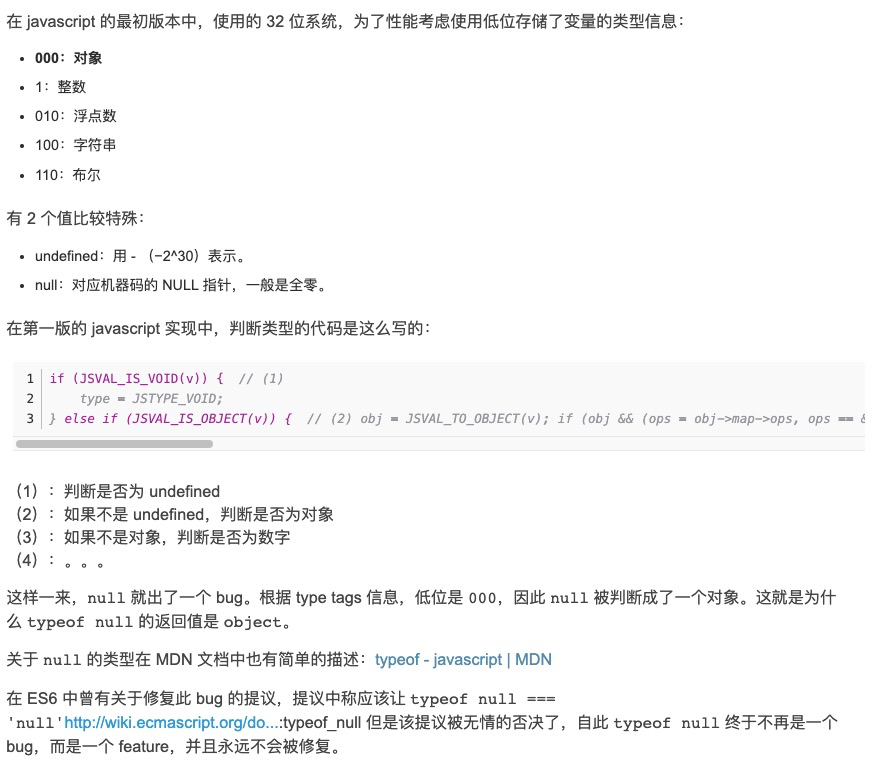
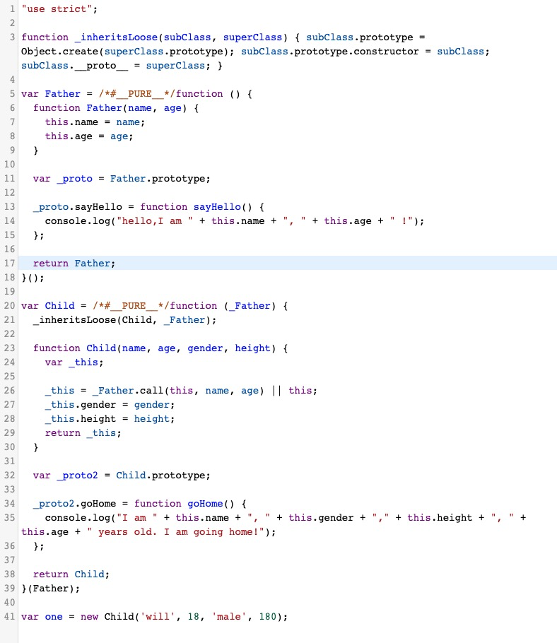
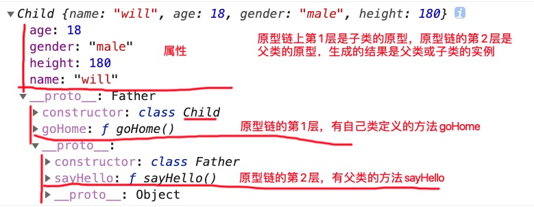

#### prototype __prototype


#### 灵魂拷问

既然Object,Array,CustomClass（等构造函数）是Function实例（隐式）化的，自定义对象又是通过CustomClass实例化得到的，自定义对象是Function的实例么？为什么？


##### js new过程到底值执行了什么

问题：就上图的描述，new过程到底值执行了什么？


思考：......
1、执行构造函数，得到一个新对象
2、将构造函数的原型，挂载到新对象上
3、得到新对象


##### instanceof 判断的原理（依据）
判断实例是不是某类对象的实例，去实例对象的原型链里寻找，如果原型链里的某一环原型与类对象的原型一致，就认为该实例是该类对象的实例。


所以，一个实例可以是多个类对象的实例。

##### isPrototypeOf
isPrototypeOf() 方法用来检测一个对象是否存在于另一个对象的原型链中，如果存在就返回 true，否则就返回 false。
与 instanceof 有相似的检测

解读下一下执行结果：

``` javascript
var f = function () {}
console.log(Object.prototype.isPrototypeOf(f));  
console.log(Function.prototype.isPrototypeOf(f));  
console.log(Function.prototype.isPrototypeOf(Object));  
console.log(Object.prototype.isPrototypeOf(Function));  
console.log(Object.prototype.isPrototypeOf(Object.prototype));  
console.log(Object.prototype.isPrototypeOf(Function.prototype));  
console.log(Function.prototype.isPrototypeOf(Function.prototype));  
console.log(Function.prototype.isPrototypeOf(Object.prototype));  
```


```javascript

function Person02(name,age){
    this.name = name;
    this.age = age;
}
Person02.prototype = {
    constructor:Person02,
    sayHello:function(){
        console.log(`hello I am ${this.name}  , ${this.age} ages old.`);
    }
}

let one = new Person02('will',18);
console.log(one instanceof Person02);
console.log(one instanceof Object);

```

##### typeof 的实现原理




原理是这样的，不同的对象在底层都表示为二进制，在 JavaScript 中二进制前三位都为 0 的话会被判断为 object 类型，null 的二进制表示是全 0，自然前三位也是 0，所以执行 typeof 时会返回“object”。

除了null以外的值类型及函数判断都是完美的，引用类型的判断最好别用typeof

提问：能聊一聊你理解的原型和原型链么？


#### 继承的实现方式

关键词:构造函数继承/原型链继承/组合继承/原型式继承/寄生式继承/寄生组合式继承   

何为继承？
子类实例化过程中，父类、子类的构造函数都是得到顺序执行，实例化以后，子类实例得到父类实例的所有属性与方法，(相同的属性或方法，会通过子类覆盖父类处理)，并且（子类的实例 instanceof 父类/子类） 都是true。
能实现以上描述的父类、子类，我们称之为子类实现了对父类的继承。


看看ES6是如何实现继承的
```javascript
//看下ES6的实现
class Father{
    constructor(name,age){
        this.name = name;
        this.age = age;
    }
    sayHello(){
        console.log(`hello,I am ${this.name}, ${this.age} !`);
    }
}

class Child extends Father{
    constructor(name,age,gender,height){
        super(name,age);
        this.gender = gender;
        this.height = height;
    }

    goHome(){
        console.log(`I am ${this.name}, ${this.gender},${this.height}, ${this.age} years old. I am going home!`);
    }
}

let one = new Child('will',18,'male',180);

console.log(one);


```




ES6继承转码：核心原理：
0、闭包封装
1、在子类执行之前，通过Object.create挂载父类的原型，得到子类的原型对象，后面扩展子类的原型时直接在这个原型对象上扩展。
2、在子类执行时构造函数前，先执行父类的构造函数。

缺点：有代码侵入


体会下 subClass.__proto__ = superClass;
对象关联扩展的好方法。


继承自我实现

```javascript
function Father(name,age){
    this.name = name;
    this.age = age;
}
//如果显示定义怕prototype对象的化，请一定手动加上constructor属性
Father.prototype = {
    constructor:Father,
    sayHello:function(){
        console.log(`hello,I am ${this.name}, ${this.age} !`);
    }
}

function Child(gender,height){
    this.gender = gender;
    this.height = height;
}

Child.prototype = {
    constructor:Child,
    goHome(){
        console.log(`I am ${this.name}, ${this.gender},${this.height}, ${this.age} years old. I am going home!`);
    }
}

//继承实现【原创】 __proto__ 兼容性有待考验
Function.prototype.myInherit = function(Father,FatherParams,selfParams){
    /*
    let obj = {};
    Father.apply(obj,FatherParams);
    this.apply(obj,selfParams);
    obj.__proto__ = this.prototype;
    this.prototype.__proto__ = Father.prototype;
    return obj;
    */

    /*
    let obj = {};
    Father.apply(obj,FatherParams);
    this.apply(obj,selfParams);
    obj.__proto__ = Object.setPrototypeOf(this.prototype,Father.prototype);
    return obj;
    */

    this.prototype = Object.setPrototypeOf(this.prototype,Father.prototype);
    let newObj = new this(...selfParams);
    //父类构造函数后置
    Father.apply(newObj,FatherParams);

    return newObj;

}

let one = Child.myInherit(Father,['will',19],['male',180]);

```

##### 通用的ES5寄生组合式继承
```javascript
function Father(name,age){
    this.name = name;
    this.age = age;
}
//如果显示定义怕prototype对象的化，请一定手动加上constructor属性
Father.prototype = {
    constructor:Father,
    sayHello:function(){
        console.log(`hello,I am ${this.name}, ${this.age} !`);
    }
}

function Child(gender,height,fatherParams){
    Father.apply(this,fatherParams);
    this.gender = gender;
    this.height = height;
}
// 提问，
// 需要人有说出用Object.create的原因? 这点很很很很重要！继承的关键!


/*
Child.prototype = Object.create(Father.prototype);
Child.prototype.constructor = Child;
Child.prototype.goHome = function(){
    console.log(`I am ${this.name}, ${this.gender},${this.height}, ${this.age} years old. I am going home!`);
}
*/

Child.prototype = Object.setPrototypeOf({
    constructor:Child,
    goHome(){
        console.log(`I am ${this.name}, ${this.gender},${this.height}, ${this.age} years old. I am going home!`);
    }
},Father.prototype);


let one = new Child('male',180,['will',18]);

console.log(one);
```
以上3个继承方法，使用方法不一样但却实现了完全同样的功能。666！

##### 解读网上6继承方式

https://blog.csdn.net/kingsleytong/article/details/68943675
1、构造继承     继承补全
2、原型链继承   (实现了)   所有子类的实例的原型都共享同一个超类实例的属性和方法
3、组合继承     实际上子类上会拥有超类的两份属性，构造函数执行了2次
4、原型式继承   好没有实现继承吧
5、寄生式继承   静态的？
6、寄生组合继承


