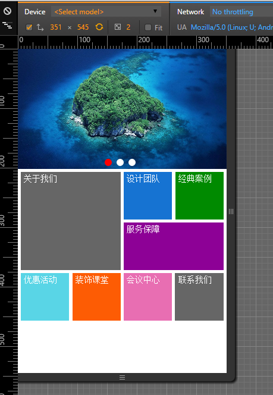

## grid 布局

### grid布局初体验

从二维（行列/长宽）2个方向，摆放页面元素，类似通过坐标实现元素定位，想想就觉得牛掰,

例:如何实现以下页面布局 <br/>



先不考虑grid布局，想想一下，要实现一个二维布局方案，我们考虑哪些东西。
1. 建立自己的坐标体系
2. 定义元素的坐标位置
3. 将元素在坐标系里展示出来(系统自己做渲染)

[Demo地址](https://codesandbox.io/s/grid-95x41d?file=/src/index.tsx)

grid布局也是对应的2个核心概念：容器、子项（容器元素）,这也很好理解,我们看下这2个对象有哪些属性，都有什么作用

### 容器的设置
容器就是最外层的标签，它有哪些属性呢
1. display
取值 grid/inline-grid 容器展示;
2. grid-template-columns (grid-template-rows)
定义容器应该有几行几列（非常重要！！）
```css
// 3行3列
// repeat, autofill, autofit, minmax
// 列需要定义的是宽度
grid-template-columns: 100px 100px 100px;
// 行需要定义的是宽度 
grid-template-rows:100px 100px 100px;
```


``` css
//容器展示
display: grid/inline-grid;
//定义格子间的间隙,靠边的没有间隙


grid-gap：10px;
是grid-row-gap的grid-column-gap的间歇

grid-auto-flow
grid-auto-rows
grid-auto-columns


grid-template-areas
grid-template
```


